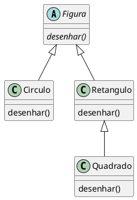
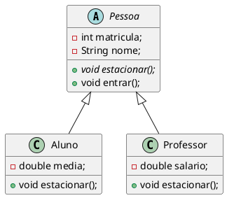
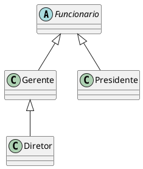

# Classes Abstratas 


- Classes abstratas são classes que não produzem instâncias. Elas agrupam características e comportamentos que serão herdados por outras classes
- Fornecem padrões de comportamento que serão implementados nas suas subclasses
- Podem ter métodos com implementação definida
- Não pode ser instanciada diretamente (`new`).
- Uma classe abstrata possui características que devem/podem ser implementadas por classes filhas
- Os métodos abstratos são obrigatoriamente implementados pelas classes filhas concretas, quando a mesma herda de uma classe abstrata. 

<figure>



<figcaption>A classe figura não faz sentido gerar uma instancia.</figcaption>
</figure>

```java 

public abstract class Figura {
    private String cor;

    public Figura(String cor) {
        this.cor = cor;
    }

    public String getCor() {
        return cor;
    }

    // Profecia Aberta: toda figura deve se desenhar
    public abstract void desenhar();
}

class Circulo extends Figura {
    private double raio;

    public Circulo(String cor, double raio) {
        super(cor);
        this.raio = raio;
    }

    @Override
    public void desenhar() {
        IO.println("⬤ Desenhando um círculo " + getCor() + " de raio " + raio);
    }
}

class Retangulo extends Figura {
    private double largura, altura;

    public Retangulo(String cor, double largura, double altura) {
        super(cor);
        this.largura = largura;
        this.altura = altura;
    }

    @Override
    public void desenhar() {
        IO.println("▬ Desenhando um retângulo " + getCor() +
                    " (" + largura + " x " + altura + ")");
    }
}
```


```java
public abstract class Pessoa { 
    int matricula; 
    String nome; 
    public abstract void estacionar(); 
    public void entrar(){ 
        IO.println("Entrando na Faculdade"); 
    } 
}
```

```java
public class Aluno extends Pessoa { 
    double media; 

    public void estacionar(){ 
        IO.println("Estacionando na área para estudante..."); 
    } 
} 
```

```java
public class Professor extends Pessoa { 
    double salario;
    public void estacionar(){ 
        IO.println("Estacionando nas vagas de professor"); 
    } 
}
```

<figure>



<figcaption>UML Classe abstrata Pessoa e classes concretas Aluno e Professor.</figcaption>
</figure>

## Outros Exemplos

### Caelum 

[^caelumoo]

Vamos recordar em como pode estar nossa classe `Funcionario`:

```java
class Funcionario {
    protected String nome;
    protected String cpf;
    protected double salario;
    public double getBonificacao() {
        return this.salario * 1.2;
    }
    // outros métodos aqui
}
```

Considere o nosso `ControleDeBonificacao`:

```java
class ControleDeBonificacoes {
    private double totalDeBonificacoes = 0;
    public void registra(Funcionario f) {
        IO.println("Adicionando bonificação do funcionario: " + f);
        this.totalDeBonificacoes += f.getBonificacao();
    }
    public double getTotalDeBonificacoes() {
        return this.totalDeBonificacoes;
    }
}
```

Nosso método `registra` recebe qualquer referência do tipo `Funcionario`, isto é, podem ser objetos do tipo `Funcionario` e qualquer de seus subtipos: `Gerente`, `Diretor` e, eventualmente, alguma nova subclasse que venha ser escrita, sem prévio conhecimento do autor da `ControleDeBonificacao`.

Estamos utilizando aqui a classe `Funcionario` para o polimorfismo. Se não fosse ela, teríamos um grande prejuízo: precisaríamos criar um método `registra` para receber cada um dos tipos de `Funcionario`, um para `Gerente`, um para `Diretor`, etc. Repare que perder esse poder é muito pior do que a pequena vantagem que a herança traz em herdar código.

Porém, em alguns sistemas, como é o nosso caso, usamos uma classe com apenas esses intuitos: de economizar um pouco código e ganhar polimorsmo para criar métodos mais genéricos, que se encaixem a diversos objetos.

Faz sentido ter uma referência do tipo `Funcionario`? Essa pergunta é diferente de saber se faz sentido ter um objeto do tipo `Funcionario:` nesse caso, faz sim e é muito útil.

Referenciando `Funcionario` temos o polimorfismo de referência, já que podemos receber qualquer objeto que seja um `Funcionario`. Porém, dar `new` em `Funcionario` pode não fazer sentido, isto é, não queremos receber um objeto do tipo `Funcionario`, mas sim que aquela referência seja ou um `Gerente`, ou um `Diretor`, etc. Algo mais **concreto** que um `Funcionario`.

```java
ControleDeBonificacoes cdb = new ControleDeBonificacoes();
Funcionario f = new Funcionario();
cdb.adiciona(f); // faz sentido?
```

Vejamos um outro caso em que não faz sentido ter um objeto daquele tipo, apesar da classe existir: imagine a classe `Pessoa` e duas filhas, `PessoaFisica` e `PessoaJuridica`. Quando puxamos um relatório de nossos clientes (uma `array` de `Pessoa` por exemplo), queremos que cada um deles seja ou uma `PessoaFisica`, ou uma `PessoaJuridica`. A classe `Pessoa`, nesse caso, estaria sendo usada apenas para ganhar o polimorfismo e herdar algumas coisas: não faz sentido permitir instanciá-la.

Para resolver esses problemas, temos as *classes abstratas*.


#### Classe abstrata

O que, exatamente, vem a ser a nossa classe `Funcionario`? Nossa empresa tem apenas Diretores, Gerentes, Secretárias, etc. Ela é uma classe que apenas idealiza um tipo, define apenas um rascunho.

Para o nosso sistema, é inadmissível que um objeto seja apenas do tipo `Funcionario` (pode existir um sistema em que faça sentido ter objetos do tipo Funcionario ou apenas `Pessoa`, mas, no nosso caso, não).

Usamos a palavra chave *abstract* para impedir que ela possa ser instanciada. Esse é o efeito direto de se usar o modificador `abstract` na declaração de uma classe:

```java
abstract class Funcionario {
    protected double salario;
    public double getBonificacao() {
        return this.salario * 1.2;
    }
    // outros atributos e métodos comuns a todos Funcionarios
}
```

E, no meio de um código:

```java
Funcionario f = new Funcionario(); // não compila!!!
```

O código acima não compila. O problema é instanciar a classe - criar referência, você pode. Se ela não pode ser instanciada, para que serve? Serve para o polimorfismo e herança dos atributos e métodos, que são recursos muito poderosos, como já vimos.

Vamos então herdar dessa classe, reescrevendo o método `getBonificacao`

```java
class Gerente extends Funcionario {
    public double getBonificacao() {
        return this.salario * 1.4 + 1000;
    }
}
```

<figure>



<figcaption>UML da classe abstrata Funcionario e das classes concretas Gerente, Presidente e Diretor.</figcaption>

</figure>

Mas qual é a real vantagem de uma classe abstrata? Poderíamos ter feito isto com uma herança comum. Por enquanto, a única diferença é que não podemos instanciar um objeto do tipo `Funcionario`, que já é de grande valia, dando mais consistência ao sistema.

Fique claro que a nossa decisão de transformar `Funcionario` em uma classe abstrata dependeu do nosso domínio. Pode ser que, em um sistema com classes similares, faça sentido que uma classe análoga a `Funcionario` seja concreta.

#### Métodos abstratos
Se o método `getBonificacao` não fosse reescrito, ele seria herdado da classe mãe, fazendo com que devolvesse o salário mais 20%.

Levando em consideração que cada funcionário em nosso sistema tem uma regra totalmente diferente para ser bonificado, faz algum sentido ter esse método na classe `Funcionario`? Será que existe uma bonificação padrão para todo tipo de `Funcionario`? Parece que não, cada classe filha terá um método diferente de bonificação pois, de acordo com nosso sistema, não existe uma regra geral: queremos que cada pessoa que escreve a classe de um `Funcionario` diferente (subclasses de `Funcionario`) reescreva o método `getBonificacao` de acordo com as suas regras.

Poderíamos, então, jogar fora esse método da classe `Funcionario`? O problema é que, se ele não existisse, não poderíamos chamar o método apenas com uma referência a um `Funcionario`, pois ninguém garante que essa referência aponta para um objeto que possui esse método. Será que então devemos retornar um código, como um número negativo? Isso não resolve o problema: se esquecermos de reescrever esse método, teremos dados errados sendo utilizados como bônus.

Existe um recurso em Java que, em uma classe abstrata, podemos escrever que determinado método será sempre escrito pelas classes filhas. Isto é, um **método abstrato**.

Ele indica que todas as classes filhas (concretas, isto é, que não forem abstratas) devem reescrever esse método ou não compilarão. É como se você herdasse a responsabilidade de ter aquele método.

::: {.callout-tip title="Como declarar um método abstrato"}
Às vezes, não fica claro como declarar um método abstrato.

Basta escrever a palavra chave *abstract* na assinatura do mesmo e colocar um ponto e vírgula em vez de abre e fecha chaves!
:::

```java
abstract class Funcionario {
    abstract double getBonificacao();
    // outros atributos e métodos
}
```


### K19

[^k19oo]


#### Classes Abstratas

No banco, todas as contas são de um tipo específico. Por exemplo, conta poupança, conta corrente ou conta salário. Essas contas poderiam ser modeladas através das seguintes classes utilizando o conceito de herança:

```java
class Conta {
    // Atributos
    // Construtores
    // Métodos
}
```

```java
class ContaPoupanca extends Conta {
    // Atributos
    // Construtores
    // Métodos
}
```

```java
class ContaCorrente extends Conta {
    // Atributos
    // Construtores
    // Métodos
}
```

Para cada conta do domínio do banco devemos criar um objeto da classe correspondente ao tipo da conta. Por exemplo, se existe uma conta poupança no domínio do banco devemos criar um objeto da classe `ContaPoupanca`.

```java
ContaPoupanca cp = new ContaPoupanca();
```

Faz sentido criar objetos da classe `ContaPoupanca` pois existem contas poupança no domínio do banco. Dizemos que a classe `ContaPoupanca` é uma classe concreta pois criaremos objetos a partir dela.

Por outro lado, a classe `Conta` não define uma conta que de fato existe no domínio do banco. Ela apenas serve como "base" para definir as contas concretos.

Não faz sentido criar um objeto da classe `Conta` pois estaríamos instanciado um objeto que não é suficiente para representar uma conta que pertença ao domínio do banco. Mas, a princípio, não há nada proibindo a criação de objetos dessa classe. Para adicionar essa restrição no sistema, devemos tornar a classe `Conta` **abstrata**.

Uma classe concreta pode ser diretamente utilizada para instanciar objetos. Por outro lado, uma classe abstrata não pode. Para definir uma classe abstrata, basta adicionar o modificador abstract.

```java
abstract class Conta {
    // Atributos
    // Construtores
    // Métodos
}
```

Todo código que tenta criar um objeto de uma classe abstrata não compila.

```java
// Erro de compilação
Conta c = new Conta();
```

#### Métodos Abstratos
Suponha que o banco ofereça extrato detalhado das contas e para cada tipo de conta as informações e o formato desse extrato detalhado são diferentes. Além disso, a qualquer momento o banco pode mudar os dados e o formato do extrato detalhado de um dos tipos de conta.

Neste caso, parece não fazer sentido ter um método na classe `Conta` para gerar extratos detalhados pois ele seria reescrito nas classes específicas sem nem ser reaproveitado.

Poderíamos, simplesmente, não definir nenhum método para gerar extratos detalhados na classe `Conta`. Porém, não haveria nenhuma garantia que as classes que derivam direta ou indiretamente da classe `Conta` implementem métodos para gerar extratos detalhados.

Mas, mesmo supondo que toda classe derivada implemente um método para gerar os extratos que desejamos, ainda não haveria nenhuma garantia em relação as assinaturas desses métodos. As classes derivadas poderiam definir métodos com nomes ou parâmetros diferentes. Isso prejudicaria a utilização dos objetos que representam as contas devido a falta de padronização das operações.

Para garantir que toda classe concreta que deriva direta ou indiretamente da classe `Conta` tenha uma implementação de método para gerar extratos detalhados e além disso que uma mesma assinatura de método seja utilizada, devemos utilizar o conceito de métodos abstratos.

Na classe `Conta`, definimos um método abstrato para gerar extratos detalhados. Um método abstrato não possui corpo (implementação).

```java
abstract class Conta {
    // Atributos
    // Construtores
    // Métodos
    public abstract void imprimeExtratoDetalhado();
}
```

As classes concretas que derivam direta ou indiretamente da classe Conta devem possuir uma implementação para o método `imprimeExtratoDetalhado()`.

```java
class ContaPoupanca extends Conta {
    private int diaDoAniversario ;
    public void imprimeExtratoDetalhado(){
        IO.println("EXTRATO DETALHADO DE CONTA POUPANÇA") ;
        DateTimeFormatter formatter = DateTimeFormatter.ofPattern("dd/MM/yyyy HH:mm:ss")
        LocalDateTime agora = LocalDateTime.now();
        
        IO.println("DATA:"+ agora.format(formatter));
        IO.println("SALDO:"+this.getSaldo());
        IO.println("ANIVERSÁRIO:"+this.diaDoAniversario);
    }
}
```

Se uma classe concreta derivada da classe `Conta` não possuir uma implementação do método `imprimeExtratoDetalhado()` ela não compilará.

```java
// ESSA CLASSE NÃO COMPILA
class ContaPoupanca extends Conta {
}
```


## Referências

<!-- @include: ../../includes/bib.md -->