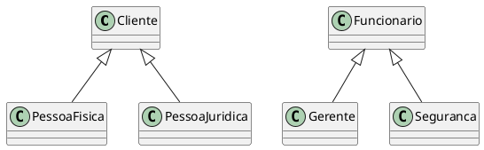
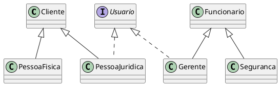
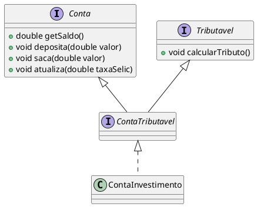

# Interface

## Padronização

No dia a dia, estamos acostumados a utilizar aparelhos que dependem de energia elétrica. Esses aparelhos possuem um plugue que deve ser conectado a uma tomada para obter a energia necessária.

Diversas empresas fabricam aparelhos elétricos com plugues. Analogamente, diversas empresas fabricam tomadas elétricas. Suponha que cada empresa decida por conta própria o formato dos plugues ou das tomadas que fabricará. Teríamos uma infinidade de tipos de plugues e tomadas que tornaria a utilização dos aparelhos elétricos uma experiência extremamente desagradável.

Inclusive, essa falta de padrão pode gerar problemas de segurança aos usuários. Os formatos dos plugues ou das tomadas pode aumentar o risco de uma pessoa tomar um choque elétrico.

Com o intuito de facilitar a utilização dos consumidores e aumentar a segurança dos mesmos, o governo através dos órgãos responsáveis estabelece padrões para os plugues e tomadas. Esses padrões estabelecem restrições que devem ser respeitadas pelos fabricantes dos aparelhos e das tomadas.

Em diversos contextos, padronizar pode trazer grandes benefícios. Inclusive, no desenvolvimento de aplicações. Mostraremos como a ideia de padronização pode ser contextualizada nos conceitos de orientação a objetos.

## Contratos
Num sistema orientado a objetos, os objetos interagem entre si através de chamadas de métodos (troca de mensagens). Podemos dizer que os objetos se “encaixam” através dos métodos públicos assim como um plugue se encaixa em uma tomada através dos pinos.

Para os objetos de uma aplicação “conversarem” entre si mais facilmente é importante padronizar o conjunto de métodos oferecidos por eles. Assim como os plugues encaixam nas tomadas mais facilmente graças aos padrões definidos pelo governo.

Um padrão é definido através de especificações ou contratos. Nas aplicações orientadas a objetos, podemos criar um “contrato” para definir um determinado conjunto de métodos que deve ser implementado pelas classes que “assinarem” este contrato. Em orientação a objetos, um contrato é chamado de interface. Um interface é composta basicamente por métodos abstratos.


## Exemplo
No sistema do banco, podemos definir uma interface (contrato) para padronizar as assinaturas dos métodos oferecidos pelos objetos que representam as contas do banco.

```java
interface Conta {
    void deposita ( double valor ) ;
    void saca ( double valor ) ;
}
```

Os métodos de uma interface não possuem corpo (implementação) pois serão implementados nas classes vinculadas a essa interface. Todos os métodos de uma interface devem ser públicos e abstratos. Os modificadores public e **abstract** são opcionais.

As classes que definem os diversos tipos de contas que existem no banco devem implementar (assinar) a interface Conta.

```java
class ContaPoupanca implements Conta {
    public void deposita ( double valor ) {
    // implementacao
    }
    public void saca ( double valor ) {
    // implementacao
    }
}
```

```java
class ContaCorrente implements Conta {
    public void deposita ( double valor ) {
    // implementacao
    }
    public void saca ( double valor ) {
    // implementacao
    }
}
```

As classes concretas que implementam uma interface são obrigadas a possuir uma implementação para cada método declarado na interface. Caso contrário, ocorrerá um erro de compilação.

```java
// Esta classe não compila porque ela não implementou o método saca ()
class ContaCorrente implements Conta {
    public void deposita ( double valor ) {
    // implementacao
    }
}
```

A primeira vantagem de utilizar uma interface é a padronização das assinaturas dos métodos oferecidos por um determinado conjunto de classes. A segunda vantagem é garantir que determinadas classes implementem certos métodos.

## Se comporta como um

A relação entre uma interface e uma classe que a implementa é semelhante a relação de herança entre classes. Porem, nessa herança, não tem o que ser herdado, apenas vem a obrigação de implementar os métodos declarados na interface.

Nessa relação, podemos dizer que uma classe que implementa uma interface "se comporta como" a interface que ela implementa.

Por exemplo, em um sistema bancário, podemos ter um produto que seja uma `PrevidenciaPrivada`. Esse produto pode ser tratado como uma conta bancária para fins de depósito e saque de dinheiro.

```java
class PrevidenciaPrivada implements Conta {
    public void deposita ( double valor ) {
    // implementacao
    }
    public void saca ( double valor ) {
    // implementacao
    }
}
``` 
Dessa forma, podemos dizer que a classe `PrevidenciaPrivada` se comporta como uma `Conta` pois ela implementa a interface `Conta`.

## Polimorfismo com interface

Se uma classe implementa uma interface, podemos aplicar a ideia do polimorfismo assim como quando aplicamos herança. Dessa forma, outra vantagem da utilização de interfaces é o ganho do polimorfismo.

Como exemplo, suponha que a classe ContaCorrente implemente a interface Conta. Podemos guardar a referência de um objeto do tipo ContaCorrente em uma variável do tipo Conta.

```java
Conta c = new ContaCorrente();
```

Além disso, podemos passar uma variável do tipo ContaCorrente para um método que o parâmetro seja do tipo Conta.

```java
class GeradorDeExtrato {
    public void geraExtrato ( Conta c ) {
    // implementação
    }
}
```

```java
GeradorDeExtrato g = new GeradorDeExtrato();
ContaCorrente c = new ContaCorrente();
g.geraExtrato(c) ;
```

O método `geraExtrato()` pode ser utilizado para objetos criados a partir de classes que implementam direta ou indiretamente a interface Conta.


## Interface e Herança

As vantagens e desvantagens entre interface e herança, provavelmente, é um dos temas mais discutido nos blogs, fóruns e revistas que abordam desenvolvimento de software orientado a objetos.

Muitas vezes, os debates sobre este assunto se estendem mais do que a própria importância desse tópico. Muitas pessoas se posicionam de forma radical defendendo a utilização de interfaces ao invés de herança em qualquer situação.

Normalmente, esses debates são direcionados na análise do que é melhor para manutenção das aplicações: utilizar interfaces ou aplicar herança.

A grosso modo, priorizar a utilização de interfaces permite que alterações pontuais em determinados trechos do código fonte sejam feitas mais facilmente pois diminui as ocorrências de efeitos colaterais indesejados no resto da aplicação. Por outro lado, priorizar a utilização de herança pode diminuir a quantidade de código escrito no início do desenvolvimento de um projeto.

Algumas pessoas propõem a utilização de interfaces juntamente com composição para substituir totalmente o uso de herança. De fato, esta é uma alternativa interessante pois possibilita que um trecho do código fonte de uma aplicação possa ser alterado sem causar efeito colateral no restante do sistema além de permitir a reutilização de código mais facilmente.

Em Java, como não há herança múltipla, muitas vezes, interfaces são apresentadas como uma alternativa para obter um grau maior de polimorfismo.

Por exemplo, suponha duas árvores de herança independentes


<figure>



<figcaption>Duas árvores de herança independentes.</figcaption>
</figure>

Suponha que os gerentes e as empresas possam acessar o sistema do banco com um nome de usuário e uma senha. Seria interessante utilizar um único método para implementar a autenticação desses dois tipos de objetos. Mas, qual seria o tipo de parâmetro deste método? Lembrando que ele deve aceitar gerentes e empresas.

```java
class AutenticadorDeUsuario {
    public boolean autentica (??? u ) {
    // implementação
    }
}
```

De acordo com as árvores de herança, não há polimorfismo entre objetos da classe Gerente e da classe Empresa. Para obter polimorfismo entre os objetos dessas duas classes somente com herança, deveríamos colocá-las na mesma árvore de herança. Mas, isso não faz sentido pois uma empresa não é um funcionário e o gerente não é cliente. Neste caso, a solução é utilizar interfaces para obter o polimorfismo desejado


<figure>



<figcaption>Obtendo mais polimorfismo.</figcaption>
</figure>


Agora, conseguimos definir o que o método autentica() deve receber como parâmetro para trabalhar tanto com gerentes quanto com empresas. Ele deve receber um parâmetro do tipo Usuario.


```java
// Usuario.java
public interface Usuario {
    boolean autenticar();    
}
```
```java
// Cliente.java
public class Cliente {
    //...    
}
```
```java
// PessoaFisica.java
public class PessoaFisica extends Cliente {
    //...
}
```
```java
// PessoaJuridica.java
public class PessoaJuridica extends Cliente implements Usuario {
    //...    
    public boolean autenticar(){
        return true;
    }   
}
```
```java
// Funcionario.java
public class Funcionario {
    //...
}
```
```java
// Gerente.java
public class Gerente extends Funcionario implements Usuario {
    //...
    public boolean autenticar(){
        return true;
    }       
}
```
```java
// Seguranca.java
public class Seguranca extends Funcionario {
    //...
}
```
```java
// AutenticadorDeUsuario.java
public class AutenticadorDeUsuario {
    public boolean autentica ( Usuario u ) {
        // implementação
    }
}
```


### Mais sobre herança e interface

```java
public interface Conta {
    double getSaldo();
    void deposita(double valor);
    void saca(double valor);
    void atualiza(double taxaSelic);
}

class ContaCorrente implements Conta {
// ...
}
class ContaPoupanca implements Conta {
// ...
}
``` 

Às vezes, é interessante criarmos uma interface que herda de outras interfaces: essas, são chamadas subinterfaces. Essas, nada mais são do que um agrupamento de obrigações para a classe que a implementar

```java
interface  Tributavel {
    //...
    public void calcularTributo();
}
```

```java
interface ContaTributavel extends Conta, Tributavel {

}
```
Dessa maneira, quem for implementar essa nova interface precisa implementar todos os métodos herdados das suas superinterfaces (e talvez ainda novos métodos declarados dentro dela):

```java
class ContaInvestimento implements ContaTributavel {
// métodos
}

``` 

```java
ContaTributavel ct = new ContaInvestimento();
Conta c = new ContaInvestimento();
Tributavel t = new ContaInvestimento();
```

Perceba que o código pode parecer estranho, pois a interface não declara método algum, só herda os métodos abstratos declarados nas outras interfaces. Ao mesmo tempo que uma interface pode herdar de mais de uma outra interface, classes só podem possuir uma classe mãe (herança simples).

<figure>



<figcaption>Representação da herança entre interfaces.</figcaption>
</figure>

### Interfaces = Classe Abstratas 

Em algumas linguagens de programação não existe o conceito de `interface`. 

A `interface` é um tipo específico de classe abstrata onde existe apenas as definições de comportamentos.

## Interface com métodos default

Em Java, a partir da versão 8, as interfaces podem conter métodos com implementação padrão, chamados de métodos `default`. Esses métodos permitem que as interfaces forneçam implementações padrão para alguns de seus métodos, sem exigir que todas as classes que implementam a interface os sobrescrevam.

```java 
public interface ExemploInterface {
    void metodoAbstrato();

    default void metodoDefault() {
        IO.println("Implementação padrão do método default.");
    }
}
```
As classes que implementam essa interface podem optar por sobrescrever o método `default`, mas não são obrigadas a fazê-lo. Isso permite que as interfaces evoluam ao longo do tempo, adicionando novos métodos com implementações padrão, sem quebrar as classes existentes que já implementam a interface.

```java
public class ExemploClasse implements ExemploInterface {
    @Override
    public void metodoAbstrato() {
        IO.println("Implementação do método abstrato.");
    }

    // Não é necessário sobrescrever o método default
}
```
### Implementando múltiplas interfaces com métodos default

Se uma classe implementa várias interfaces que possuem métodos `default` com o mesmo nome, a classe deve sobrescrever esse método para resolver a ambiguidade

```java
public interface InterfaceA {
    default void metodo() {
        IO.println("InterfaceA - método default");
    }
}
public interface InterfaceB {
    default void metodo() {
        IO.println("InterfaceB - método default");
    }
}
public class ExemploClasse implements InterfaceA, InterfaceB {
    @Override
    public void metodo() {
        // Resolvendo a ambiguidade
        InterfaceA.super.metodo(); // Chama o método default da InterfaceA
        InterfaceB.super.metodo(); // Chama o método default da InterfaceB
    }
}
```

Caso a classe não sobrescreva o método, ocorrerá um erro de compilação devido à ambiguidade entre os métodos `default` das interfaces.

::: {.callout-caution}
> _Duplicate default methods named metodo with the parameters () and () are inherited from the types InterfaceB and InterfaceAJava(67109917)_
:::


## Referências

<!-- @include: ../../includes/bib.md -->