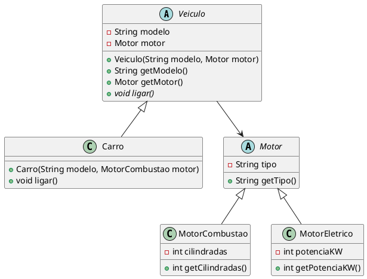
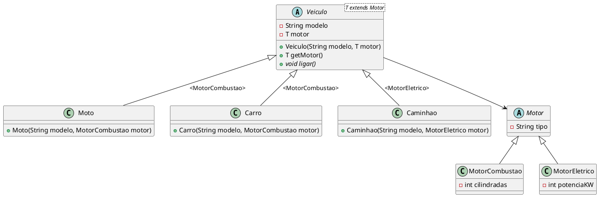

# Tipificação Forte e Generics em Java

[^jai_generics_2014]

## 1. O Problema: Tipificação Forte vs. Flexibilidade

### 1.1 Tipificação Forte em Java

Java é uma linguagem de tipificação forte (ou fortemente tipada), o que significa que o tipo de uma variável é verificado em tempo de compilação e não pode ser alterado dinamicamente durante a execução do programa. Isso implica que o compilador Java verifica se as operações realizadas com uma variável são compatíveis com seu tipo declarado.

Por exemplo, você não pode atribuir uma String a uma variável do tipo int:

```java
// tiposIncompativeis.java
int numero = 10;
numero = "Texto"; // Erro de compilação: tipos incompatíveis
```

A tipificação forte evita erros comuns, como tentar acessar métodos ou propriedades que não existem para um determinado tipo, reduzindo bugs e facilitando a depuração.

No entanto, em sistemas dinâmicos onde precisamos reaproveitar estruturas para manipular múltiplos tipos de dados, a tipificação forte rígida impõe desafios. Historicamente, duas abordagens foram utilizadas antes do surgimento dos Generics.

---

### 1.2 Tentativa 1: Abordagem Legada com `Object`

Antes do Java 5, a forma comum de criar coleções ou estruturas reutilizáveis era utilizar a classe base `Object`. Como toda classe em Java herda de `Object`, era possível armazenar qualquer dado.

```java
// ExemploObject.java
import java.util.ArrayList;
import java.util.List;

public class ExemploObject {
    public static void main(String[] args) {
        // Lista sem generics (usa Object)
        List lista = new ArrayList();
        
        // Adicionando elementos de tipos diferentes
        lista.add("Texto"); // String
        lista.add(10);      // Integer
        lista.add(3.14);    // Double

        // Recuperando elementos (precisa de cast)
        String texto = (String) lista.get(0);
        Integer numero = (Integer) lista.get(1);
        Double decimal = (Double) lista.get(2);

        System.out.println("Texto: " + texto);
        System.out.println("Número: " + numero);
        System.out.println("Decimal: " + decimal);

        // Problema: Erro em tempo de execução se o cast estiver errado
        try {
            Integer erro = (Integer) lista.get(0); // ClassCastException
        } catch (ClassCastException e) {
            System.out.println("Erro de cast em runtime: " + e.getMessage());
        }
    }
}
```

<codapi-snippet sandbox="java" editor="basic"></codapi-snippet>

::: {.callout-caution title="Risco em Tempo de Execução"}
O uso de `Object` desativa a checagem de tipos em tempo de compilação. Se um cast incorreto for feito (como tentar converter uma `String` recuperada para `Integer`), o programa compila normalmente, mas lança uma exceção `ClassCastException` em tempo de execução.
:::

---

### 1.3 Tentativa 2: Herança Tradicional sem Generics

Considere o modelo de domínio de veículos a seguir, sem o uso de Generics:



Ao implementar as classes sem generics:

```java
// Motor.java
public abstract class Motor {
    private String tipo;

    public Motor(String tipo) {
        this.tipo = tipo;
    }

    public String getTipo() {
        return tipo;
    }
}
```
```java
// MotorCombustao.java
public class MotorCombustao extends Motor {
    private int cilindradas;

    public MotorCombustao(int cilindradas) {
        super("Combustão");
        this.cilindradas = cilindradas;
    }

    public int getCilindradas() {
        return cilindradas;
    }
}
```
```java
// MotorEletrico.java
public class MotorEletrico extends Motor {
    private int potenciaKW;

    public MotorEletrico(int potenciaKW) {
        super("Elétrico");
        this.potenciaKW = potenciaKW;
    }

    public int getPotenciaKW() {
        return potenciaKW;
    }
}
```
```java
// Veiculo.java
public abstract class Veiculo {
    private String modelo;
    private Motor motor;

    public Veiculo(String modelo, Motor motor) {
        this.modelo = modelo;
        this.motor = motor;
    }

    public String getModelo() {
        return modelo;
    }

    public Motor getMotor() {
        return motor;
    }

    public abstract void ligar();
}
```
```java
// Carro.java
public class Carro extends Veiculo {
    public Carro(String modelo, MotorCombustao motor) {
        super(modelo, motor);
    }

    @Override
    public void ligar() {
        IO.println("Carro " + getModelo() + " está ligado.");
    }
}
```

#### O Dilema do Cast no Retorno:

Mesmo garantindo no construtor de `Carro` que o motor recebido é um `MotorCombustao`, a classe base `Veiculo` define que `getMotor()` retorna `Motor`. 

```java
// TestaVeiculos.java
public class TestaVeiculos {
    public static void main(String[] args) {
        Carro carro = new Carro("Sedan", new MotorCombustao(2000));

        // getMotor() retorna Motor. Para acessar métodos específicos, EXIGE CAST!
        Motor motorGenerico = carro.getMotor();
        MotorCombustao motorCombustao = (MotorCombustao) motorGenerico; // Cast explícito!

        System.out.println("Modelo: " + carro.getModelo());
        System.out.println("Cilindradas: " + motorCombustao.getCilindradas());
    }
}
```

Para acessar o método específico `getCilindradas()`, o desenvolvedor é **obrigado a fazer um cast explícito**:
```java
MotorCombustao mc = (MotorCombustao) carro.getMotor(); // Cast necessário
```

---

## 2. Solução com Generics: Tipos Parametrizados

Os **Generics** foram introduzidos no Java 5 para permitir que classes, interfaces e métodos operem com tipos parametrizados. Eles permitem criar código reutilizável e seguro, eliminando a necessidade de casts explícitos e capturando erros de tipo em **tempo de compilação**.

### 2.1 Sintaxe Básica em Coleções

Com generics, informamos o tipo desejado entre corchetes angulares `<T>`:

```java
// ExemploGenerics.java
import java.util.ArrayList;
import java.util.List;

public class ExemploGenerics {
    public static void main(String[] args) {
        // Lista com generics (tipo específico: String)
        List<String> listaDeStrings = new ArrayList<>();
        
        // Adicionando elementos (apenas Strings são permitidas)
        listaDeStrings.add("Texto 1");
        listaDeStrings.add("Texto 2");
        // listaDeStrings.add(10); // Erro de compilação: tipo incompatível

        // Recuperando elementos (sem necessidade de cast)
        String texto1 = listaDeStrings.get(0);
        String texto2 = listaDeStrings.get(1);

        System.out.println("Texto 1: " + texto1);
        System.out.println("Texto 2: " + texto2);

        // Exemplo com classe genérica
        Caixa<Integer> caixaDeInteiros = new Caixa<>();
        caixaDeInteiros.setConteudo(42);
        int valor = caixaDeInteiros.getConteudo(); // Sem cast
        System.out.println("Valor na caixa: " + valor);
    }
}
```

<codapi-snippet sandbox="java" editor="basic"></codapi-snippet>

### 2.2 Tabela Comparativa

| Aspecto | Uso de `Object` | Uso de Generics (`<T>`) |
| :--- | :--- | :--- |
| **Segurança de Tipo** | Nenhuma verificação em compilação. | Verificação estática em tempo de compilação. |
| **Casts** | Obrigatórios e propensos a erro. | Desnecessários. |
| **Flexibilidade** | Aceita qualquer objeto, sem controle de tipo. | Aceita tipos específicos parametrizados. |
| **Detecção de Erros** | Erros em runtime (`ClassCastException`). | Erros de compilação imediatos na IDE. |


### 2.3 Criando Classes Genéricas

Podemos criar nossas próprias classes parametrizadas usando letras convencionais como `T` (Type), `E` (Element), `K` (Key), `V` (Value), `U`, `V` etc.

#### Exemplo com Parâmetro Único (`Caixa<T>`):
```java
// Caixa.java
public class Caixa<T> {
    private T conteudo;

    public void setConteudo(T conteudo) {
        this.conteudo = conteudo;
    }

    public T getConteudo() {
        return conteudo;
    }
}
```

#### Exemplo de Teste Genérico Simples:
```java
// GenericsTest.java
public class GenericsTest {
    public static void main(String[] args) {
        Test<String> test1 = new Test<>("Test String.");
        test1.showItemDetails();

        Test<Integer> test2 = new Test<>(100);
        test2.showItemDetails();
    }
}

class Test<T> {
    private T item;

    public Test(T item) {
        this.item = item;
    }

    public T getItem() {
        return item;
    }

    public void setItem(T item) {
        this.item = item;
    }

    public void showItemDetails() {
        System.out.println("Value of the item: " + item);
        System.out.println("Type of the item: " + item.getClass().getName());
    }
}
```

<codapi-snippet sandbox="java" editor="basic"></codapi-snippet>

#### Exemplo com Múltiplos Parâmetros Genéricos (`Par<T, U>`):
```java
// GenericsTest2.java
public class GenericsTest2 {
    public static void main(String[] args) {
        Par<String, Integer> par = new Par<>("Test String.", 100);
        par.showItemDetails();
    }
}

class Par<T, U> {
    private T itemT;
    private U itemU;

    public Par(T itemT, U itemU) {
        this.itemT = itemT;
        this.itemU = itemU;
    }

    public T getItemT() { return itemT; }
    public U getItemU() { return itemU; }

    public void showItemDetails() {
        System.out.println("Value of itemT: " + itemT + " (Type: " + itemT.getClass().getName() + ")");
        System.out.println("Value of itemU: " + itemU + " (Type: " + itemU.getClass().getName() + ")");
    }
}
```

<codapi-snippet sandbox="java" editor="basic"></codapi-snippet>

---

### 2.4 Aplicando Generics no Domínio `Veiculo`

Ao tornar a classe base `Veiculo` genérica parametrizando o motor com `<T>`, resolvemos o problema do cast:

```java
// Veiculo.java
public abstract class Veiculo<T> {
    private String modelo;
    private T motor;

    public Veiculo(String modelo, T motor) {
        this.modelo = modelo;
        this.motor = motor;
    }

    public String getModelo() {
        return modelo;
    }

    public T getMotor() {
        return motor;
    }

    public abstract void ligar();
}
```
```java
// Carro.java
public class Carro extends Veiculo<MotorCombustao> {
    public Carro(String modelo, MotorCombustao motor) {
        super(modelo, motor);
    }

    @Override
    public void ligar() {
        IO.println("Carro " + getModelo() + " está ligado.");
    }
}
```
```java
// TestaVeiculos.java
public class TestaVeiculos {
    public static void main(String[] args) {
        Carro carro = new Carro("Sedan", new MotorCombustao(2000));

        // getMotor() retorna MotorCombustao DIRETO! Sem necessidade de Cast!
        MotorCombustao motor = carro.getMotor();
        System.out.println("Modelo: " + carro.getModelo());
        System.out.println("Cilindradas: " + motor.getCilindradas());
    }
}
```

::: {.callout-tip title="Vitória do Generics"}
Ao chamar `carro.getMotor()`, o método retorna diretamente o tipo `MotorCombustao`. Não é necessário fazer nenhum cast!
:::

---

## 3. Tipos Delimitados (Bounded Type Parameters - `T extends X`)

### 3.1 O Problema do Generics "Aberto"

No exemplo anterior (`Veiculo<T>`), o tipo `T` está totalmente aberto. O compilador aceitará **qualquer tipo de objeto** como parâmetro.

O que impede alguém de definir uma classe `Geladeira` e tentar criar um `Veiculo<Geladeira>`?

```java
// Geladeira.java
public class Geladeira {
    private int capacidadeLitros;

    public Geladeira(int capacidadeLitros) {
        this.capacidadeLitros = capacidadeLitros;
    }

    public int getCapacidadeLitros() {
        return capacidadeLitros;
    }
}
```

Ou criar uma motocicleta cujo motor é um `Integer`?

```java
// Pop.java
// Erro de compilação: Integer não herda de Motor!
public class Pop extends Veiculo<Integer> {
    public Pop(String modelo, Integer motor) {
        super(modelo, motor);
    }

    @Override
    public void ligar() {
        IO.println("Pop " + getModelo() + " está ligada.");
    }
}
```

Uma geladeira ou um número inteiro **não são motores**! Precisamos restringir o tipo genérico `T` para garantir a integridade do domínio.

---

### 3.2 Restringindo o Tipo Genérico com `T extends Motor`

O uso de `T extends ClasseOuInterface` impõe um limite superior (*upper bound*). Isso garante que o tipo genérico `T` deve ser a classe especificada ou qualquer uma de suas subclasses.



#### Implementação com Bounds:

```java
// Veiculo.java
public abstract class Veiculo<T extends Motor> {
    private String modelo;
    private T motor;

    public Veiculo(String modelo, T motor) {
        this.modelo = modelo;
        this.motor = motor;
    }

    public String getModelo() {
        return modelo;
    }

    public T getMotor() {
        return motor;
    }

    public abstract void ligar();
}
```
```java
// Carro.java
public class Carro extends Veiculo<MotorCombustao> {
    public Carro(String modelo, MotorCombustao motor) {
        super(modelo, motor);
    }

    @Override
    public void ligar() {
        IO.println("Carro " + getModelo() + " está ligado.");
    }
}
```
```java
// Moto.java
public class Moto extends Veiculo<MotorCombustao> {
    public Moto(String modelo, MotorCombustao motor) {
        super(modelo, motor);
    }

    @Override
    public void ligar() {
        IO.println("Moto " + getModelo() + " está ligada.");
    }
}
```
```java
// Caminhao.java
public class Caminhao extends Veiculo<MotorEletrico> {
    public Caminhao(String modelo, MotorEletrico motor) {
        super(modelo, motor);
    }

    @Override
    public void ligar() {
        IO.println("Caminhão " + getModelo() + " está ligado.");
    }
}
```

#### Testando a Hierarquia Tipada:
```java
// TestaVeiculos.java
public class TestaVeiculos {
    public static void main(String[] args) {
        // Criando motores
        MotorCombustao motorCarro = new MotorCombustao(2000);
        MotorCombustao motorMoto = new MotorCombustao(600);
        MotorEletrico motorCaminhao = new MotorEletrico(300);

        // Criando veículos
        Carro carro = new Carro("Sedan", motorCarro);
        Moto moto = new Moto("Esportiva", motorMoto);
        Caminhao caminhao = new Caminhao("Carga Pesada", motorCaminhao);

        // Acesso direto ao tipo específico sem necessidade de cast!
        IO.println("Cilindradas do Carro: " + carro.getMotor().getCilindradas());
        IO.println("Cilindradas da Moto: " + moto.getMotor().getCilindradas());
        IO.println("Potência do Caminhão: " + caminhao.getMotor().getPotenciaKW() + " kW");

        carro.ligar();
        moto.ligar();
        caminhao.ligar();
    }
}
```

```console
Cilindradas do Carro: 2000
Cilindradas da Moto: 600
Potência do Caminhão: 300 kW
Carro Sedan está ligado.
Moto Esportiva está ligada.
Caminhão Carga Pesada está ligado.
```

::: {.callout-caution title="Proteção em Tempo de Compilação"}
Com a restrição `T extends Motor`, a tentativa de declarar `class Pop extends Veiculo<Integer>` ou `Veiculo<Geladeira>` gerará um **erro de compilação**, pois nem `Integer` nem `Geladeira` herdam de `Motor`.
:::

---

### 3.3 Segundo Exemplo Prático: Calculadora de Área

Bounded types também funcionam com **interfaces**. Abaixo, garantimos que a `CalculadoraArea` só aceita tipos que implementem a interface `FormaGeometrica`:

```java
// FormaGeometrica.java
public interface FormaGeometrica {
    double calcularArea();
}
```
```java
// Circulo.java
public class Circulo implements FormaGeometrica {
    private double raio;

    public Circulo(double raio) {
        this.raio = raio;
    }

    @Override
    public double calcularArea() {
        return Math.PI * raio * raio;
    }
}
```
```java
// Retangulo.java
public class Retangulo implements FormaGeometrica {
    private double largura;
    private double altura;

    public Retangulo(double largura, double altura) {
        this.largura = largura;
        this.altura = altura;
    }

    @Override
    public double calcularArea() {
        return largura * altura;
    }
}
```
```java
// CalculadoraArea.java
import java.util.List;

public class CalculadoraArea {

    // O método aceita uma lista de QUALQUER tipo, desde que implemente FormaGeometrica
    public double calcularAreaTotal(List<? extends FormaGeometrica> formas) {
        return formas.stream()
                .mapToDouble(FormaGeometrica::calcularArea)
                .sum();
    }
}
```
```java
// TestaCalculadoraArea.java
import java.util.List;

public class TestaCalculadoraArea {
    public static void main(String[] args) {
        // Criando formas geométricas variadas
        Circulo circulo = new Circulo(5.0);
        Retangulo retangulo = new Retangulo(4.0, 6.0);

        // Criando uma lista que aceita qualquer FormaGeometrica
        List<FormaGeometrica> listaDeFormas = new ArrayList<>();
        listaDeFormas.add(circulo);
        listaDeFormas.add(retangulo);

        // Calculadora processa a lista mista
        CalculadoraArea calculadora = new CalculadoraArea();
        double areaTotal = calculadora.calcularAreaTotal(listaDeFormas);

        System.out.println("Área Total (Círculo + Retângulo): " + areaTotal);
    }
}
```

```console
Área do círculo: 78.53981633974483
Área do retângulo: 24.0
```

::: {.callout-warning title="Erro de Tipo Ilegal"}
Se tentarmos criar uma `CalculadoraArea<String>`, o compilador impedirá a execução com o erro:
`Type parameter 'java.lang.String' is not within its bound; should implement 'FormaGeometrica'`
:::

---

## 4. Tópicos Avançados em Generics

### 4.1 Métodos Genéricos

Além de classes genéricas, é possível declarar **métodos genéricos** em classes normais. A assinatura do método inclui o tipo parametrizado antes do tipo de retorno:

```java
// MetodosGenericosExemplo.java
public class MetodosGenericosExemplo {

    // Método genérico para imprimir elementos de qualquer tipo de array
    public static <E> void imprimirArray(E[] array) {
        for (E elemento : array) {
            System.out.print(elemento + " ");
        }
        System.out.println();
    }

    public static void main(String[] args) {
        Integer[] numeros = { 1, 2, 3, 4, 5 };
        String[] nomes = { "Ana", "Bia", "Carlos" };
        Double[] decimais = { 1.5, 2.5, 3.5 };

        System.out.print("Array de Inteiros: ");
        imprimirArray(numeros);

        System.out.print("Array de Strings: ");
        imprimirArray(nomes);

        System.out.print("Array de Decimais: ");
        imprimirArray(decimais);
    }
}
```

<codapi-snippet sandbox="java" editor="basic"></codapi-snippet>

---

### 4.2 Wildcards (Coringas `?`) e o Princípio PECS

#### 4.2.1 O Problema da Invariância

Em Java, Generics são **invariantes**. Isso significa que, mesmo que `Carro` seja uma subclasse de `Veiculo`, a coleção `List<Carro>` **NÃO é uma subclasse** de `List<Veiculo>`.

Se o Java permitisse essa atribuição:
```java
List<Carro> carros = new ArrayList<>();
List<Veiculo> veiculos = carros; // ❌ Erro de compilação!
veiculos.add(new Moto()); // Se permitisse, teríamos uma Moto dentro de uma List<Carro>!
```

Para contornar a invariância e permitir que métodos aceitem coleções com hierarquias de herança mantendo a segurança de tipos, utilizam-se os **Wildcards** (representados pelo caractere coringa `?`).

---

#### 4.2.2 Tipos de Wildcards e Restrições de Leitura/Escrita

1. **Unbounded Wildcard (`List<?>`) - Coringa Não Delimitado**:
   - Aceita uma lista de qualquer tipo (`List<String>`, `List<Integer>`, etc.).
   - **Leitura**: Retorna elementos sempre como o tipo base `Object`.
   - **Escrita**: **Proibida**. O compilador não permite adicionar nenhum elemento (exceto `null`), pois não sabe o tipo exato da lista.

2. **Upper Bounded Wildcard (`List<? extends T>`) - Limite Superior**:
   - Restringe o tipo a `T` ou a qualquer uma de suas **subclasses**.
   - **Leitura**: **Permitida e Segura**. É garantido que qualquer elemento lido possa ser tratado como `T`.
   - **Escrita**: **Proibida**. O compilador impede a adição de novos objetos (exceto `null`), pois não é possível garantir se a lista real subjacente é de `Carro`, `Moto` ou outra classe derivada de `T`.

3. **Lower Bounded Wildcard (`List<? super T>`) - Limite Inferior**:
   - Restringe o tipo a `T` ou a qualquer uma de suas **superclasses** (até `Object`).
   - **Leitura**: **Limitada**. Como os elementos podem ser de qualquer superclasse de `T`, o compilador só garante a leitura como `Object`.
   - **Escrita**: **Permitida e Segura**. É seguro adicionar instâncias de `T` (ou subclasses de `T`), pois a lista garante aceitar no mínimo o tipo `T`.

---

#### 4.2.3 O Princípio PECS: **Producer Extends, Consumer Super**

Formulado por Joshua Bloch (*Effective Java*), o princípio **PECS** define qual wildcard escolher com base no papel da coleção dentro do método:

- **PE — Producer Extends (Produtor usa `extends`)**:
  - Se o seu método **apenas lê** dados da coleção (a coleção *produz* elementos para uso do seu método), declare o parâmetro como `List<? extends T>`.
- **CS — Consumer Super (Consumidor usa `super`)**:
  - Se o seu método **apenas escreve/insere** dados na coleção (a coleção *consome* elementos fornecidos pelo seu método), declare o parâmetro como `List<? super T>`.
- **Leitura e Escrita Simultâneas**:
  - Se você precisa **tanto ler quanto escrever** elementos na mesma coleção, **não use wildcards**. Use um tipo genérico exato `<T>`.

#### Tabela Comparativa de Wildcards:

| Sintaxe Wildcard | Tipo de Limite | Leitura (`get`) | Escrita (`add`) | Papel PECS |
| :--- | :--- | :--- | :--- | :--- |
| `List<?>` | Nenhum (Qualquer tipo) | Retorna `Object` | ❌ Apenas `null` | Apenas consulta geral |
| `List<? extends T>` | Limite Superior (`T` ou subclasses) | Retorna `T` | ❌ Apenas `null` | **Producer** (Produtor) |
| `List<? super T>` | Limite Inferior (`T` ou superclasses) | Retorna `Object` | Aceita `T` e derivadas | **Consumer** (Consumidor) |

---

#### 4.2.4 Exemplo Prático em Código:

```java
// WildcardPECSExemplo.java
import java.util.ArrayList;
import java.util.List;

public class WildcardPECSExemplo {

    // PRODUCER EXTENDS: apenas leitura da lista
    public static double somarAreas(List<? extends FormaGeometrica> formas) {
        double total = 0;
        for (FormaGeometrica f : formas) {
            total += f.calcularArea();
        }
        return total;
    }

    // CONSUMER SUPER: apenas adição/escrita na lista
    public static void adicionarCirculo(List<? super Circulo> lista, double raio) {
        lista.add(new Circulo(raio));
    }

    public static void main(String[] args) {
        List<Circulo> circulos = new ArrayList<>();
        circulos.add(new Circulo(2.0));
        circulos.add(new Circulo(3.0));

        // Producer Extends em ação: aceita List<Circulo> em parâmetro List<? extends FormaGeometrica>
        System.out.println("Soma das áreas: " + somarAreas(circulos));

        // Consumer Super em ação
        List<Object> objetos = new ArrayList<>();
        adicionarCirculo(objetos, 4.0);
        System.out.println("Círculo adicionado em lista genérica com sucesso.");
    }

    interface FormaGeometrica {
        double calcularArea();
    }

    static class Circulo implements FormaGeometrica {
        private double raio;
        public Circulo(double raio) { this.raio = raio; }
        @Override public double calcularArea() { return Math.PI * raio * raio; }
    }
}
```

<codapi-snippet sandbox="java" editor="basic"></codapi-snippet>

---

### 4.3 Type Erasure (Apagamento de Tipos) e Limitações

Para manter compatibilidade retroativa com versões antigas do Java (anteriores à versão 5), o compilador Java aplica o conceito de **Type Erasure** (Apagamento de Tipos):

1. **Remoção de Generics**: Durante a compilação, todas as informações de tipos genéricos `<T>` são removidas e substituídas por seu limite (`Object` ou a classe do `extends`).
2. **Casts Automáticos**: O compilador insere os casts apropriados no bytecode compilado (`.class`).

#### Limitações do Generics decorrentes do Type Erasure:
- **Sem Tipos Primitivos**: Não é possível usar `List<int>`. Utilize classes *wrapper* como `List<Integer>`.
- **Não é possível instanciar `new T()`**: Não podemos criar instâncias diretas do tipo genérico `T`.
- **Não é possível criar arrays de tipos genéricos**: `new T[10]` não é permitido.
- **Não é possível usar `instanceof T`**: Como o tipo é apagado em runtime, checagens diretas como `obj instanceof T` geram erro de compilação.

---

#### Como contornar o problema de `instanceof T` e `new T()`?

Para contornar essa limitação e realizar checagens de tipo ou instanciações dinâmicas em tempo de execução, utilizamos o padrão **Class Token** (passando explicitamente o objeto `Class<T>`):

##### 1. Contornando a verificação de tipo (`instanceof T` ➔ `Class<T>.isInstance()`):
```java
public class VerificadorTipo<T> {
    private final Class<T> classeTipo;

    public VerificadorTipo(Class<T> classeTipo) {
        this.classeTipo = classeTipo;
    }

    public boolean ehInstancia(Object obj) {
        // Substituto seguro para "obj instanceof T"
        return classeTipo.isInstance(obj);
    }
}
```


##### 2. Contornando a criação de objetos (`new T()` ➔ `Class<T>.getDeclaredConstructor()`):
```java
public T criarNovaInstancia(Class<T> clazz) throws Exception {
    // Substituto para "new T()"
    return clazz.getDeclaredConstructor().newInstance();
}
```

## Referências

<!-- @include: ../../includes/bib.md -->