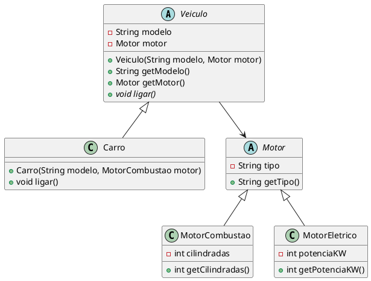
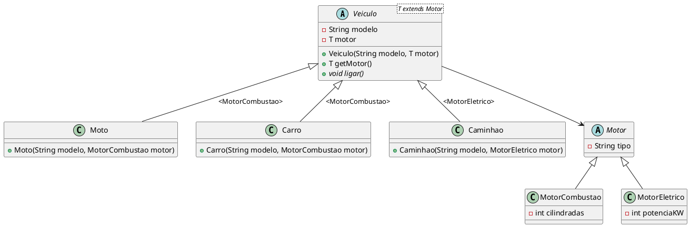

# Tipificação Forte e Generics em Java

[^jai_generics_2014]

## 1. O Problema: Tipificação Forte vs. Flexibilidade

### 1.1 Tipificação Forte em Java

Java é uma linguagem de tipificação forte (ou fortemente tipada), o que significa que o tipo de uma variável é verificado em tempo de compilação e não pode ser alterado dinamicamente durante a execução do programa. Isso implica que o compilador Java verifica se as operações realizadas com uma variável são compatíveis com seu tipo declarado.

Por exemplo, você não pode atribuir uma String a uma variável do tipo int:

@[code](./code/generics/01_problema/tiposIncompativeis.java)

A tipificação forte evita erros comuns, como tentar acessar métodos ou propriedades que não existem para um determinado tipo, reduzindo bugs e facilitando a depuração.

No entanto, em sistemas dinâmicos onde precisamos reaproveitar estruturas para manipular múltiplos tipos de dados, a tipificação forte rígida impõe desafios. Historicamente, duas abordagens foram utilizadas antes do surgimento dos Generics.

---

### 1.2 Tentativa 1: Abordagem Legada com `Object`

Antes do Java 5, a forma comum de criar coleções ou estruturas reutilizáveis era utilizar a classe base `Object`. Como toda classe em Java herda de `Object`, era possível armazenar qualquer dado.

@[code](./code/generics/01_problema/ExemploObject.java)

<codapi-snippet sandbox="java" editor="basic"></codapi-snippet>

::: {.callout-caution title="Risco em Tempo de Execução"}
O uso de `Object` desativa a checagem de tipos em tempo de compilação. Se um cast incorreto for feito (como tentar converter uma `String` recuperada para `Integer`), o programa compila normalmente, mas lança uma exceção `ClassCastException` em tempo de execução.
:::

---

### 1.3 Tentativa 2: Herança Tradicional sem Generics

Considere o modelo de domínio de veículos a seguir, sem o uso de Generics:



Ao implementar as classes sem generics:

@[code](./code/generics/01_problema/Motor.java)
@[code](./code/generics/01_problema/MotorCombustao.java)
@[code](./code/generics/01_problema/MotorEletrico.java)
@[code](./code/generics/01_problema/Veiculo.java)
@[code](./code/generics/01_problema/Carro.java)

#### O Dilema do Cast no Retorno:

Mesmo garantindo no construtor de `Carro` que o motor recebido é um `MotorCombustao`, a classe base `Veiculo` define que `getMotor()` retorna `Motor`. 

@[code](./code/generics/01_problema/TestaVeiculos.java)

Para acessar o método específico `getCilindradas()`, o desenvolvedor é **obrigado a fazer um cast explícito**:
```java
MotorCombustao mc = (MotorCombustao) carro.getMotor(); // Cast necessário
```

---

## 2. Solução com Generics: Tipos Parametrizados

Os **Generics** foram introduzidos no Java 5 para permitir que classes, interfaces e métodos operem com tipos parametrizados. Eles permitem criar código reutilizável e seguro, eliminando a necessidade de casts explícitos e capturando erros de tipo em **tempo de compilação**.

### 2.1 Sintaxe Básica em Coleções

Com generics, informamos o tipo desejado entre corchetes angulares `<T>`:

@[code](./code/generics/02_generics_basico/ExemploGenerics.java)

<codapi-snippet sandbox="java" editor="basic"></codapi-snippet>

### 2.2 Tabela Comparativa

| Aspecto | Uso de `Object` | Uso de Generics (`<T>`) |
| :--- | :--- | :--- |
| **Segurança de Tipo** | Nenhuma verificação em compilação. | Verificação estática em tempo de compilação. |
| **Casts** | Obrigatórios e propensos a erro. | Desnecessários. |
| **Flexibilidade** | Aceita qualquer objeto, sem controle de tipo. | Aceita tipos específicos parametrizados. |
| **Detecção de Erros** | Erros em runtime (`ClassCastException`). | Erros de compilação imediatos na IDE. |


### 2.3 Criando Classes Genéricas

Podemos criar nossas próprias classes parametrizadas usando letras convencionais como `T` (Type), `E` (Element), `K` (Key), `V` (Value), `U`, `V` etc.

#### Exemplo com Parâmetro Único (`Caixa<T>`):
@[code](./code/generics/02_generics_basico/Caixa.java)

#### Exemplo de Teste Genérico Simples:
@[code](./code/generics/02_generics_basico/GenericsTest.java)

<codapi-snippet sandbox="java" editor="basic"></codapi-snippet>

#### Exemplo com Múltiplos Parâmetros Genéricos (`Par<T, U>`):
@[code](./code/generics/02_generics_basico/GenericsTest2.java)

<codapi-snippet sandbox="java" editor="basic"></codapi-snippet>

---

### 2.4 Aplicando Generics no Domínio `Veiculo`

Ao tornar a classe base `Veiculo` genérica parametrizando o motor com `<T>`, resolvemos o problema do cast:

@[code](./code/generics/02_generics_basico/Veiculo.java)
@[code](./code/generics/02_generics_basico/Carro.java)
@[code](./code/generics/02_generics_basico/TestaVeiculos.java)

::: {.callout-tip title="Vitória do Generics"}
Ao chamar `carro.getMotor()`, o método retorna diretamente o tipo `MotorCombustao`. Não é necessário fazer nenhum cast!
:::

---

## 3. Tipos Delimitados (Bounded Type Parameters - `T extends X`)

### 3.1 O Problema do Generics "Aberto"

No exemplo anterior (`Veiculo<T>`), o tipo `T` está totalmente aberto. O compilador aceitará **qualquer tipo de objeto** como parâmetro.

O que impede alguém de definir uma classe `Geladeira` e tentar criar um `Veiculo<Geladeira>`?

@[code](./code/generics/03_bounded_types/Geladeira.java)

Ou criar uma motocicleta cujo motor é um `Integer`?

@[code](./code/generics/03_bounded_types/Pop.java)

Uma geladeira ou um número inteiro **não são motores**! Precisamos restringir o tipo genérico `T` para garantir a integridade do domínio.

---

### 3.2 Restringindo o Tipo Genérico com `T extends Motor`

O uso de `T extends ClasseOuInterface` impõe um limite superior (*upper bound*). Isso garante que o tipo genérico `T` deve ser a classe especificada ou qualquer uma de suas subclasses.



#### Implementação com Bounds:

@[code](./code/generics/03_bounded_types/Veiculo.java)
@[code](./code/generics/03_bounded_types/Carro.java)
@[code](./code/generics/03_bounded_types/Moto.java)
@[code](./code/generics/03_bounded_types/Caminhao.java)

#### Testando a Hierarquia Tipada:
@[code](./code/generics/03_bounded_types/TestaVeiculos.java)

```console
Cilindradas do Carro: 2000
Cilindradas da Moto: 600
Potência do Caminhão: 300 kW
Carro Sedan está ligado.
Moto Esportiva está ligada.
Caminhão Carga Pesada está ligado.
```

::: {.callout-caution title="Proteção em Tempo de Compilação"}
Com a restrição `T extends Motor`, a tentativa de declarar `class Pop extends Veiculo<Integer>` ou `Veiculo<Geladeira>` gerará um **erro de compilação**, pois nem `Integer` nem `Geladeira` herdam de `Motor`.
:::

---

### 3.3 Segundo Exemplo Prático: Calculadora de Área

Bounded types também funcionam com **interfaces**. Abaixo, garantimos que a `CalculadoraArea` só aceita tipos que implementem a interface `FormaGeometrica`:

@[code](./code/generics/03_bounded_types/FormaGeometrica.java)
@[code](./code/generics/03_bounded_types/Circulo.java)
@[code](./code/generics/03_bounded_types/Retangulo.java)
@[code](./code/generics/03_bounded_types/CalculadoraArea.java)
@[code](./code/generics/03_bounded_types/TestaCalculadoraArea.java)

```console
Área do círculo: 78.53981633974483
Área do retângulo: 24.0
```

::: {.callout-warning title="Erro de Tipo Ilegal"}
Se tentarmos criar uma `CalculadoraArea<String>`, o compilador impedirá a execução com o erro:
`Type parameter 'java.lang.String' is not within its bound; should implement 'FormaGeometrica'`
:::

---

## 4. Tópicos Avançados em Generics

### 4.1 Métodos Genéricos

Além de classes genéricas, é possível declarar **métodos genéricos** em classes normais. A assinatura do método inclui o tipo parametrizado antes do tipo de retorno:

@[code](./code/generics/04_avancado/MetodosGenericosExemplo.java)

<codapi-snippet sandbox="java" editor="basic"></codapi-snippet>

---

### 4.2 Wildcards (Coringas `?`) e o Princípio PECS

#### 4.2.1 O Problema da Invariância

Em Java, Generics são **invariantes**. Isso significa que, mesmo que `Carro` seja uma subclasse de `Veiculo`, a coleção `List<Carro>` **NÃO é uma subclasse** de `List<Veiculo>`.

Se o Java permitisse essa atribuição:
```java
List<Carro> carros = new ArrayList<>();
List<Veiculo> veiculos = carros; // ❌ Erro de compilação!
veiculos.add(new Moto()); // Se permitisse, teríamos uma Moto dentro de uma List<Carro>!
```

Para contornar a invariância e permitir que métodos aceitem coleções com hierarquias de herança mantendo a segurança de tipos, utilizam-se os **Wildcards** (representados pelo caractere coringa `?`).

---

#### 4.2.2 Tipos de Wildcards e Restrições de Leitura/Escrita

1. **Unbounded Wildcard (`List<?>`) - Coringa Não Delimitado**:
   - Aceita uma lista de qualquer tipo (`List<String>`, `List<Integer>`, etc.).
   - **Leitura**: Retorna elementos sempre como o tipo base `Object`.
   - **Escrita**: **Proibida**. O compilador não permite adicionar nenhum elemento (exceto `null`), pois não sabe o tipo exato da lista.

2. **Upper Bounded Wildcard (`List<? extends T>`) - Limite Superior**:
   - Restringe o tipo a `T` ou a qualquer uma de suas **subclasses**.
   - **Leitura**: **Permitida e Segura**. É garantido que qualquer elemento lido possa ser tratado como `T`.
   - **Escrita**: **Proibida**. O compilador impede a adição de novos objetos (exceto `null`), pois não é possível garantir se a lista real subjacente é de `Carro`, `Moto` ou outra classe derivada de `T`.

3. **Lower Bounded Wildcard (`List<? super T>`) - Limite Inferior**:
   - Restringe o tipo a `T` ou a qualquer uma de suas **superclasses** (até `Object`).
   - **Leitura**: **Limitada**. Como os elementos podem ser de qualquer superclasse de `T`, o compilador só garante a leitura como `Object`.
   - **Escrita**: **Permitida e Segura**. É seguro adicionar instâncias de `T` (ou subclasses de `T`), pois a lista garante aceitar no mínimo o tipo `T`.

---

#### 4.2.3 O Princípio PECS: **Producer Extends, Consumer Super**

Formulado por Joshua Bloch (*Effective Java*), o princípio **PECS** define qual wildcard escolher com base no papel da coleção dentro do método:

- **PE — Producer Extends (Produtor usa `extends`)**:
  - Se o seu método **apenas lê** dados da coleção (a coleção *produz* elementos para uso do seu método), declare o parâmetro como `List<? extends T>`.
- **CS — Consumer Super (Consumidor usa `super`)**:
  - Se o seu método **apenas escreve/insere** dados na coleção (a coleção *consome* elementos fornecidos pelo seu método), declare o parâmetro como `List<? super T>`.
- **Leitura e Escrita Simultâneas**:
  - Se você precisa **tanto ler quanto escrever** elementos na mesma coleção, **não use wildcards**. Use um tipo genérico exato `<T>`.

#### Tabela Comparativa de Wildcards:

| Sintaxe Wildcard | Tipo de Limite | Leitura (`get`) | Escrita (`add`) | Papel PECS |
| :--- | :--- | :--- | :--- | :--- |
| `List<?>` | Nenhum (Qualquer tipo) | Retorna `Object` | ❌ Apenas `null` | Apenas consulta geral |
| `List<? extends T>` | Limite Superior (`T` ou subclasses) | Retorna `T` | ❌ Apenas `null` | **Producer** (Produtor) |
| `List<? super T>` | Limite Inferior (`T` ou superclasses) | Retorna `Object` | Aceita `T` e derivadas | **Consumer** (Consumidor) |

---

#### 4.2.4 Exemplo Prático em Código:

@[code](./code/generics/04_avancado/WildcardPECSExemplo.java)

<codapi-snippet sandbox="java" editor="basic"></codapi-snippet>

---

### 4.3 Type Erasure (Apagamento de Tipos) e Limitações

Para manter compatibilidade retroativa com versões antigas do Java (anteriores à versão 5), o compilador Java aplica o conceito de **Type Erasure** (Apagamento de Tipos):

1. **Remoção de Generics**: Durante a compilação, todas as informações de tipos genéricos `<T>` são removidas e substituídas por seu limite (`Object` ou a classe do `extends`).
2. **Casts Automáticos**: O compilador insere os casts apropriados no bytecode compilado (`.class`).

#### Limitações do Generics decorrentes do Type Erasure:
- **Sem Tipos Primitivos**: Não é possível usar `List<int>`. Utilize classes *wrapper* como `List<Integer>`.
- **Não é possível instanciar `new T()`**: Não podemos criar instâncias diretas do tipo genérico `T`.
- **Não é possível criar arrays de tipos genéricos**: `new T[10]` não é permitido.
- **Não é possível usar `instanceof T`**: Como o tipo é apagado em runtime, checagens diretas como `obj instanceof T` geram erro de compilação.

---

#### Como contornar o problema de `instanceof T` e `new T()`?

Para contornar essa limitação e realizar checagens de tipo ou instanciações dinâmicas em tempo de execução, utilizamos o padrão **Class Token** (passando explicitamente o objeto `Class<T>`):

##### 1. Contornando a verificação de tipo (`instanceof T` ➔ `Class<T>.isInstance()`):
```java
public class VerificadorTipo<T> {
    private final Class<T> classeTipo;

    public VerificadorTipo(Class<T> classeTipo) {
        this.classeTipo = classeTipo;
    }

    public boolean ehInstancia(Object obj) {
        // Substituto seguro para "obj instanceof T"
        return classeTipo.isInstance(obj);
    }
}
```


##### 2. Contornando a criação de objetos (`new T()` ➔ `Class<T>.getDeclaredConstructor()`):
```java
public T criarNovaInstancia(Class<T> clazz) throws Exception {
    // Substituto para "new T()"
    return clazz.getDeclaredConstructor().newInstance();
}
```

## Referências

<!-- @include: ../../includes/bib.md -->