# Exercício: Modelagem DVD com encapsulamento

adaptado de [^Takenami]


1. Utilizando os conhecimentos de O.O. construa um programa utilizando as informações abaixo. As características de um Aparelho de DVD devem ser definidas de acordo com as informações a seguir. Ao ser criado o Aparelho de DVD inicialmente está desligado. Seu volume pode alterar de 1 a 5 sendo que o nível inicial é 2. É possível inserir um filme no Aparelho de DVD. O filme possui as seguintes caraterísticas: nome, categoria e duração. 

    As seguintes operações podem ser realizadas pelo Aparelho de DVD:
    - ligar e desligar;
    - aumentar e diminuir volume;
    - inserir filme;
    - remover filme;
    - play e stop.

    O programa deve obedecer as seguintes regras:
    - Só é possível fazer qualquer uma destas operações se o Aparelho de DVD estiver ligado;
    - Só é possível dar play no Aparelho de DVD se existir algum filme inserido;
    - Só é possível dar stop se o Aparelho de DVD estiver em play;
    - Ao dar play deve aparecer o nome e a duração do filme que está sendo exibido.

1. Escreva o diagrama UML da classe Aparelho de DVD e implemente o código em Java para construir 1 Aparelho de DVD e 3 filmes diferentes, utilizando o construtor e os métodos definidos e inserir um filme no Aparelho de DVD.

```plantuml 
  @startuml
  class AparelhoDVD{
      boolean ligado
      int volume
      Filme filme
      boolean emPlay
      AparelhoDVD()
      void ligar()
      void desligar()
      void inserirFilme(Filme filme)
      Filme removerFilme()
  }
  class Filme{
    String nome;
    String categoria;
    double duracao;
    Filme(String nome, String categoria, double duracao)
  }
  AparelhoDVD --> Filme
  @enduml

  ```
  </figure>


```java
// DVD.java
package modelagemDVD;

/*
Utilizando os conhecimentos de O.O. construa um programa utilizando as informações abaixo. As características de um DVD devem ser definidas de acordo com as informações a seguir. Ao ser criado o DVD inicialmente está desligado. Seu volume pode alterar de 1 a 5 sendo que o nível inicial é 2. É possível inserir um filme no DVD. O filme possui as seguintes caraterísticas: nome, categoria e duração.

As seguintes operações podem ser realizadas pelo DVD:

ligar e desligar;
aumentar e diminuir volume;
inserir filme;
play e stop.
O programa deve obedecer as seguintes regras:

Só é possível fazer qualquer uma destas operações se o DVD estiver ligado;
Só é possível dar play no DVD se existir algum filme inserido;
Só é possível dar stop se o DVD estiver em play;
Ao dar play deve aparecer o nome e a duração do filme que está sendo exibido.

 */
public class DVD {
    public boolean ligado;
    private int volume;
    private Filme filme;
    private boolean emPlay;
    //Ao ser criado o DVD inicialmente está desligado. Seu volume pode alterar de 1 a 5 sendo que o nível inicial é 2.
    public DVD(){
        ligado = false;
        volume = 2;
        emPlay = false;
    }
    //Seu volume pode alterar de 1 a 5 
    public void aumentarVolume(){
        if(ligado){
            if(volume<5){
                volume++;
            }
        }
    }
    //Seu volume pode alterar de 1 a 5 
    public void diminuirVolume(){
        if(ligado && volume>1){
            volume--;
        }
    }
    //método de acesso
    public int getVolume() {
        return volume;
    }
    //método de acesso
    public void setVolume(int volume) {
        if(ligado){
            if(this.volume<=5 && this.volume>=1){
                this.volume=volume;
            }
        }
    }

    //É possível inserir um filme no DVD. 
    public void inserirFilme(Filme filme){
        if(ligado){
            if(this.filme==null){
                this.filme = filme;
            }
        }
    }
    public Filme removerFilme(){
        stop();
        Filme filmeRemovido = this.filme;
        this.filme = null;
        return filmeRemovido; 
    }

    //ligar e desligar;
    public void ligar(){
        ligado = true;
    }
    public void desligar(){                
        ligado = false;
    }
    //play e stop.
    //Só é possível dar play no DVD se existir algum filme inserido
    //Ao dar play deve aparecer o nome e a duração do filme que está sendo exibido.
    public String play(){
        if(ligado){
            if(filme!= null){
                emPlay = true;
                return filme.getNome()+" - "+filme.getDuracao();
            }
        }
        return null;
    }
    //Só é possível dar stop se o DVD estiver em play;
    public void stop(){
        if(ligado){
            if(emPlay){
                emPlay = false;
            }
        }
    }
    @Override
    public String toString() {
        return "DVD [ligado=" + ligado + ", volume=" + volume + ", filme=" + filme + ", emPlay=" + emPlay + "]";
    }

    public boolean isLigado() {
        return ligado;
    }
    public void setLigado(boolean ligado) {
        this.ligado = ligado;
    }    
}
```


::: {.callout-note title="<figure>" collapse="true"}


```java
// Filme.java
package modelagemDVD;
/*
O filme possui as seguintes caraterísticas: nome, categoria e duração.
 */
public class Filme {
    private String nome;
    private String categoria;
    private double duracao;
    
    public Filme(String nome, String categoria, double duracao) {
        this.nome = nome;
        this.categoria = categoria;
        this.duracao = duracao;
    }

    public String getNome() {
        return nome;
    }
    public double getDuracao() {
        return duracao;
    }
    public String getCategoria() {
        return categoria;
    }

    @Override
    public String toString() {
        return "Filme [nome=" + nome + ", categoria=" + categoria + ", duracao=" + duracao + "]";
    }

    

    
}
```

```java
// Mesa.java
package modelagemDVD;

public class Mesa {
    public static void main(String[] args) {
        DVD meuDVD = new DVD();
        
        Filme filme1 = new Filme("It", "Terror", 600);
        Filme filme2 = new Filme("It 2", "Terror", 800);
        System.out.println(meuDVD.toString());
        meuDVD.inserirFilme(filme1);
        meuDVD.play();
        System.out.println(meuDVD);
        meuDVD.ligar();
        meuDVD.inserirFilme(filme1);
        //meuDVD.volume = 100;
        meuDVD.play();
        meuDVD.aumentarVolume();
        meuDVD.getVolume();
        meuDVD.aumentarVolume();
        meuDVD.aumentarVolume();
        meuDVD.aumentarVolume();
        meuDVD.aumentarVolume();
        meuDVD.aumentarVolume();
        meuDVD.diminuirVolume();
        meuDVD.diminuirVolume();
        meuDVD.diminuirVolume();
        meuDVD.diminuirVolume();
        meuDVD.diminuirVolume();
        meuDVD.diminuirVolume();
        meuDVD.diminuirVolume();
        meuDVD.diminuirVolume();
        meuDVD.diminuirVolume();
        meuDVD.diminuirVolume();
        System.out.println(meuDVD);
        Filme filmeDevolvido = meuDVD.removerFilme();
        meuDVD.inserirFilme(filmeDevolvido);
        meuDVD.play();
        filmeDevolvido = meuDVD.removerFilme();
        meuDVD.inserirFilme(filme2);
        meuDVD.play();
        filmeDevolvido = meuDVD.removerFilme();
        meuDVD.inserirFilme(filme1);
        meuDVD.play();        
    }
}
```
:::


<!-- @include: ../../../includes/bib.md -->