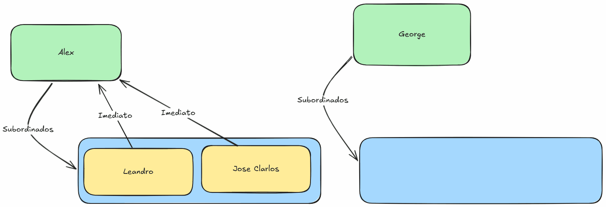

# Hierarquia Militar Simplificada

1. Modele uma simplificação da hierarquia do Exército Brasileiro. Existem diferentes patentes militares, como Soldado, Cabo, Sargento, Tenente e Capitão. Cada patente tem atributos como nome, número de identificação e tempo de serviço. Os soldados reportam aos cabos, os cabos aos sargentos, os sargentos aos tenentes e os tenentes aos capitães. A identificação deve ser única para cada patente e deve ser gerada automaticamente.
  1. Implemente método para listar os subordinados de um militar;
  2. Implemente método um método mostrar o seu superior imediato. 
  3. Durante a troca de imediato, deve ser feita a  remoção de subordinado.


   

A movimentação de um subordinado entre dois imediatos deve ser feita utilizando os métodos de remoção e adição de subordinados (no imediato)

```java
imediato1.adicionarSubordinado(subordinado);
```

ou quando um subordinado tem o valor do seu imetiato alterado.

```java
subordinado.setImediato(imediato2);
```