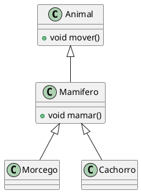
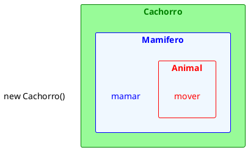
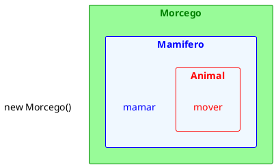

# Exercício de Herança 1

1. Considere o código abaixo, que utiliza as classes da UML apresentada, e indique, caso exista algum erro, a linha e qual o erro.

<figure>



<figcaption>Relação entre Animal, Mamífero, Morcego e Cachorro.</figcaption>
</figure>

```java
// code1.java
Animal a1 = new Animal();
Animal a2 = new Mamifero();
Animal a3 = new Cachorro();
Animal a4 = new Morcego();

Mamifero m1 = new Animal();
Mamifero m2 = new Mamifero();
Mamifero m3 = new Cachorro();
Mamifero m4 = new Morcego();

Cachorro c1 = new Animal();
Cachorro c2 = new Mamifero();
Cachorro c3 = new Cachorro();
Cachorro c4 = new Morcego();

Morcego mo1 = new Animal();
Morcego mo2 = new Mamifero();
Morcego mo3 = new Cachorro();
Morcego mo4 = new Morcego();
```

```java
// code2.java
Animal a5 = new Cachorro();
a5.mover();
a5.mamar();
Cachorro c5 = (Cachorro) a5;
c5.mover();
c5.mamar();

Mamifero m5 = new Morcego();
m5.mover();
m5.mamar();
Morcego mo5 = (Morcego) m5;
mo5.mover();
mo5.mamar();

Cachorro c6 = new Cachorro();
Mamifero m6 = c6;
Animal a6 = m6;
Morcego mo6 = a6;
```


<figure>



<figcaption>Criando um objeto Cachorro.</figcaption>
</figure>

<figure>



<figcaption>Criando um objeto Morcego.</figcaption>
</figure>