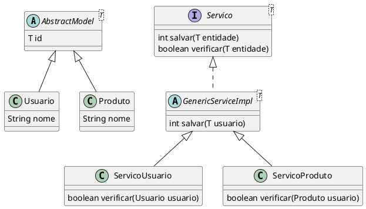

# Exercício Generics - Trabalho Parcial 2

## Comunicação entre camadas com *Abstrat* *Interface* e *Generic*
 
Atualize a sua camada de modelo para utilizar uma definição abstrata.  Essa definição deverá ter características e comportamentos comuns a todos os models do sistema, tais como ter um identificador único, identificação do momento de inserção da informação, momento da ultima atualização, usuário que cadastrou e atualizou, dentre outros.

Inspiração para classe abstrata da camada de modelo:

@[code](../code/generics/parcialTrab/AbstractModel.java)

Todos as classes da camada de modelo devem devem herdar esse modelo abstrato.

Exemplo de subclasse:

@[code](../code/generics/parcialTrab/Usuario.java)

Definir, usando interfaces + generics, os contratos de comunicação entre as camadas de Apresentação, Negócio e Dados.  A camada de Apresentação deve depender somente de interfaces, nunca de classes concretas.

## Interface genérica de serviço (Camada de Negócio)
Contrato da comunicação Apresentação->Negócio, espelhando o `GenericDAO`:

@[code](../code/generics/parcialTrab/GenericService.java)

## Implementação genérica (injeção do DAO pela interface)
A comunicação Negócio→Dados acontece pela interface `GenericDAO`, passada no construtor:

@[code](../code/generics/parcialTrab/GenericServiceImpl.java)

### Serviço específico com regras

@[code](../code/generics/parcialTrab/UsuarioService.java)

## Apresentação depende só das interfaces

@[code](../code/generics/parcialTrab/UsuarioController.java)

<figure>

<figcaption>Exemplificação de como deve ficar a relação entre as classes da camada de modelo e camada de serviço.</figcaption>
</figure>

Defina um conjunto de comportamentos para fazer a inserção (create), consulta por `id` (read), alteração (update) e exclusão (delete) de qualquer classe da camada de modelo. Essas são as operações CRUD.

@[code](../code/generics/parcialTrab/GenericDAO.java)

defina DAO genérico para atender ao conjunto do operações CRUD.

@[code](../code/generics/parcialTrab/GenericDAOImpl.java)

Criando uma classe filha de DAO genérico para acrescentar funcionalidades específicas para a classe `Usuario`:

@[code](../code/generics/parcialTrab/UsuarioDAO.java)

@[code](../code/generics/parcialTrab/IdGenerator.java)

## Entregar

Entregar a camada de modelo atualizada bem como a comunicação entre o Controler, Servico e DAO.

[Link](https://classroom.github.com/a/BCAnRDqX)