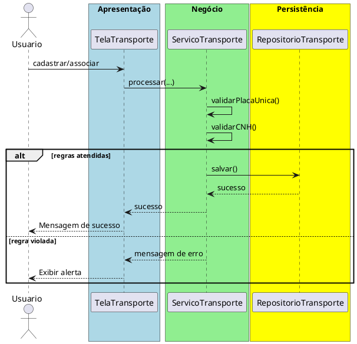

# Trabalho 11 – Sistema de Gerenciamento de Transportes – Cadastro de Veículos e Motoristas

## Cenário
Uma empresa de transporte precisa de um sistema desktop para cadastrar veículos, motoristas e associar motoristas a veículos. O desenvolvimento será em **Java**, usando **JavaFX** e a arquitetura em **três camadas**.

## Requisitos Funcionais
| Camada | Funcionalidade |
|--------|----------------|
| **Apresentação (JavaFX)** | Tela de cadastro de veículos, tela de cadastro de motoristas e tela de associação veículo‑motorista. |
| **Negócio** | • Validar dados (placa, modelo, CNH, categoria).  • Aplicar as regras de negócio abaixo. |
| **Dados** | • Armazenar veículos e motoristas em memória (`ArrayList`).  • Operações CRUD para ambas as entidades e para a associação. |

## Regras de Negócio (2)
1. **Placa Única** – Cada veículo deve ter uma placa única no sistema. Caso o usuário tente cadastrar um veículo com placa já existente, a operação deve ser abortada e o usuário avisado que a placa já está em uso.
2. **CNH Válida** – Um motorista só pode ser associado a um veículo se a sua CNH estiver válida (data de vencimento posterior à data atual). Caso contrário, a operação deve ser interrompida e o usuário receberá uma mensagem de erro.

## Fluxo de Comunicação Entre as Camadas
1. Usuário cadastra ou associa veículos/motoristas na interface JavaFX.  
2. A camada de apresentação envia os dados ao **Serviço de Transporte** (camada de negócio).  
3. O serviço valida as duas regras; se válidas, delega ao **Repositório de Transporte** (camada de dados). Caso contrário, devolve mensagem de erro.  
4. A camada de apresentação captura a mensagem e a exibe em um `Alert`.

### Diagrama de Sequência

## Barema de Avaliação (100 pontos)
| Área | Peso | Critérios |
|------|------|-----------|
| **Interface Gráfica (JavaFX)** | 20 pts | Funcionalidade completa, usabilidade, mensagens de erro claras. |
| **Camada de Negócio** | 30 pts | Implementação correta das duas regras, tratamento adequado das violações. |
| **Camada de Dados** | 20 pts | Uso adequado de coleções, CRUD funcionando. |
| **Separação em Camadas** | 20 pts | Arquitetura limpa, comunicação correta. |
| **Boas Práticas** | 10 pts | Código legível, nomes coerentes, organização. |

## Entregáveis
1. Projeto Java completo (Maven/Gradle) com os pacotes `presentation`, `business`, `data` e `model`.  
2. **README** com instruções de compilação e execução.  
3. Diagrama de classes (UML) mostrando as entidades (`Veiculo`, `Motorista`, `Associacao`).  
4. Diagrama de sequência (acima) para o caso de uso **Cadastrar/Associar Veículo**.  
5. **Testes unitários** (JUnit) que comprovem:
   - Cadastro bem‑sucedido com placa única.
   - Falha ao cadastrar placa duplicada.
   - Falha ao associar motorista com CNH vencida.