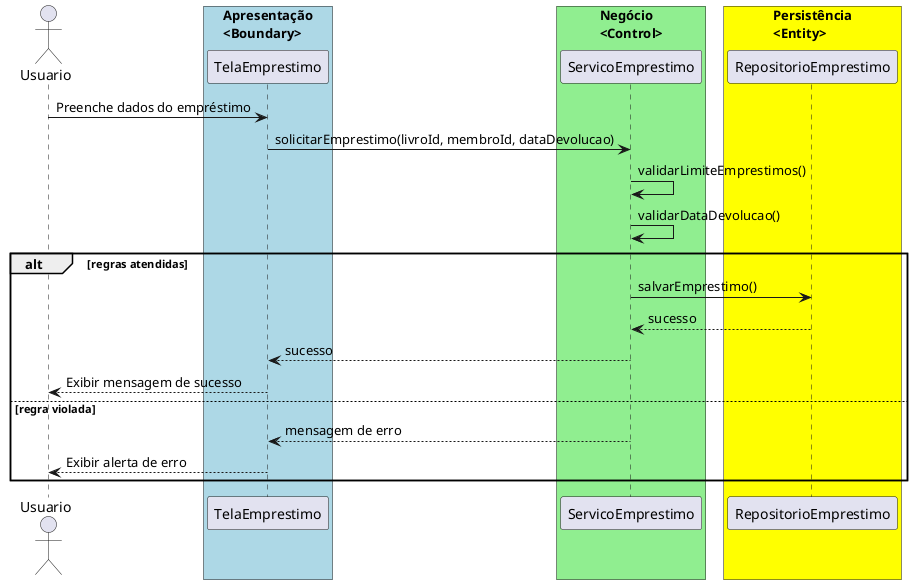

# Trabalho 01 – Sistema de Biblioteca Digital (Empréstimo de Livros)

## Cenário
Uma biblioteca universitária deseja disponibilizar um sistema desktop que permita o cadastro de livros, membros e o controle de empréstimos. O sistema será desenvolvido em **Java**, utilizando **JavaFX** para a interface gráfica e seguindo a arquitetura em **três camadas** (Apresentação, Negócio e Dados).

## Requisitos Funcionais
| Camada | Funcionalidade |
|--------|----------------|
| **Apresentação (JavaFX)** | Tela de cadastro de livros, tela de cadastro de membros, tela de registro de empréstimo e tela de devolução. Cada tela deve exibir mensagens de erro de forma clara quando houver algum problema. |
| **Negócio** | • Validar dados de entrada (ex.: ISBN, CPF, datas).  • Aplicar as regras de negócio descritas abaixo. |
| **Dados** | • Armazenar livros, membros e empréstimos em coleções em memória (`ArrayList`, `HashMap`).  • Implementar operações CRUD para cada entidade. |

## Regras de Negócio (2)
1. **Limite de Empréstimos por Membro** – Um membro não pode ter mais de **5 empréstimos ativos** simultaneamente. Se a tentativa de registrar um novo empréstimo ultrapassar esse limite, a operação deve ser interrompida e o usuário deve receber uma mensagem de erro indicando que o limite foi atingido.
2. **Data de Devolução Válida** – A data de devolução informada não pode ser **anterior** à data de empréstimo. Caso a data seja inválida, a operação deve ser abortada e o usuário deve ser avisado que a data de devolução deve ser posterior ou igual à data de empréstimo.

## Fluxo de Comunicação Entre as Camadas
1. O usuário preenche o formulário de **Empréstimo** na interface JavaFX.
2. A **Camada de Apresentação** envia os dados ao **Serviço de Empréstimo** (camada de negócio).
3. O serviço verifica as duas regras de negócio. Se ambas forem atendidas, delega ao **Repositório de Empréstimos** (camada de dados) para armazenar o registro. Caso alguma regra seja violada, o serviço interrompe a operação e devolve uma mensagem de erro.
4. A **Camada de Apresentação** captura a mensagem e a exibe em um `Alert` amigável.

### Diagrama de Sequência

## Barema de Avaliação (100 pontos)
| Área | Peso | Critérios |
|------|------|-----------|
| **Interface Gráfica (JavaFX)** | 20 pts | Funcionalidade completa, usabilidade, exibição clara de mensagens de erro. |
| **Camada de Negócio** | 30 pts | Implementação correta das duas regras de negócio, tratamento adequado das violações (mensagens de erro). |
| **Camada de Dados** | 20 pts | Uso adequado de `ArrayList`/`HashMap`, operações CRUD funcionando. |
| **Separação em Camadas** | 20 pts | Arquitetura limpa, comunicação correta entre as camadas. |
| **Boas Práticas** | 10 pts | Código legível, nomes coerentes, ausência de duplicação, organização de pacotes. |

## Entregáveis
1. Projeto Java completo (Maven ou Gradle) contendo os pacotes `presentation`, `business`, `data` e `model`.
2. **README** com instruções de compilação e execução (`mvn clean package && java -jar target/biblioteca.jar`).
3. Diagrama de classes (UML) que mostre as entidades (`Livro`, `Membro`, `Emprestimo`) e as camadas.
4. Diagrama de sequência (como o acima) para o caso de uso **Registrar Empréstimo**.
5. **Testes unitários** (JUnit) que comprovem:
   - Sucesso ao registrar um empréstimo quando as regras são atendidas.
   - Falha ao tentar registrar um sexto empréstimo para o mesmo membro.
   - Falha ao informar data de devolução anterior à data de empréstimo.