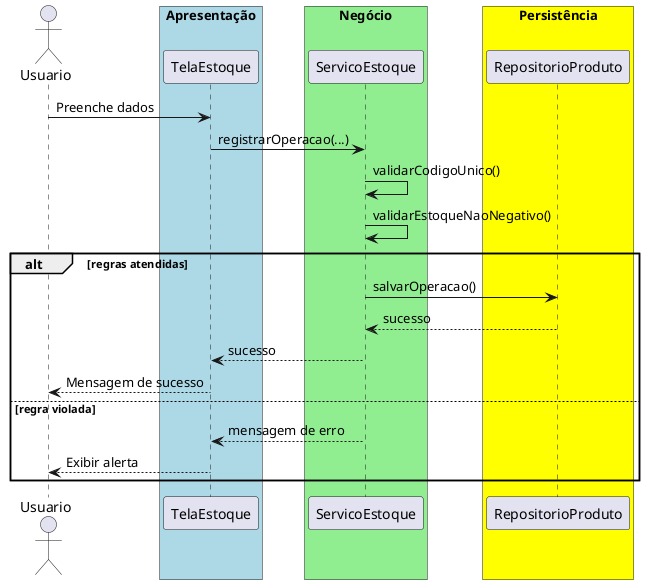

# Trabalho 02 – Sistema de Controle de Estoque (Cadastro de Produtos)

## Cenário
Uma pequena empresa de varejo precisa de um sistema desktop para cadastrar produtos, controlar o estoque e registrar entradas e saídas. O sistema será desenvolvido em **Java**, usando **JavaFX** para a interface e a arquitetura em **três camadas**.

## Requisitos Funcionais
| Camada | Funcionalidade |
|--------|----------------|
| **Apresentação (JavaFX)** | Tela de cadastro de produtos, tela de movimentação de estoque (entrada/saída) e relatório de quantidade em estoque. |
| **Negócio** | • Validar dados de entrada (código, nome, quantidade, preço).  • Aplicar as regras de negócio abaixo. |
| **Dados** | • Armazenar produtos em memória (`ArrayList`).  • Operações CRUD para produtos e movimentações. |

## Regras de Negócio (2)
1. **Código Único do Produto** – Cada produto deve possuir um código alfanumérico único. Se o usuário tentar cadastrar um produto com código já existente, a operação deve ser abortada e o usuário deve ser avisado que o código já está em uso.
2. **Estoque Não Negativo** – Ao registrar uma saída de estoque, a quantidade resultante não pode ficar abaixo de zero. Caso a operação tente reduzir o estoque para um valor negativo, a operação deve ser interrompida e o usuário deve receber uma mensagem de erro indicando estoque insuficiente.

## Fluxo de Comunicação Entre as Camadas
1. Usuário preenche o formulário de cadastro ou movimentação na interface JavaFX.
2. A **Camada de Apresentação** envia os dados ao **Serviço de Estoque** (camada de negócio).
3. O serviço verifica as duas regras de negócio. Se válidas, delega ao **Repositório de Produtos** (camada de dados) para persistir a operação. Caso contrário, devolve uma mensagem de erro.
4. A **Camada de Apresentação** captura a mensagem e a exibe em um `Alert`.

### Diagrama de Sequência

## Barema de Avaliação (100 pontos)
| Área | Peso | Critérios |
|------|------|-----------|
| **Interface Gráfica (JavaFX)** | 20 pts | Funcionalidade completa, usabilidade, exibição clara de mensagens de erro. |
| **Camada de Negócio** | 30 pts | Implementação correta das duas regras de negócio, tratamento adequado das violações. |
| **Camada de Dados** | 20 pts | Uso adequado de `ArrayList`, operações CRUD funcionando. |
| **Separação em Camadas** | 20 pts | Arquitetura limpa, comunicação correta entre as camadas. |
| **Boas Práticas** | 10 pts | Código legível, nomes coerentes, ausência de duplicação, organização de pacotes. |

## Entregáveis
1. Projeto Java completo (Maven ou Gradle) com os pacotes `presentation`, `business`, `data` e `model`.
2. **README** com instruções de compilação e execução.
3. Diagrama de classes (UML) mostrando as entidades (`Produto`, `Movimentacao`).
4. Diagrama de sequência (como acima) para o caso de uso **Registrar Movimentação**.
5. **Testes unitários** (JUnit) que comprovem:
   - Cadastro bem‑sucedido com código único.
   - Falha ao cadastrar código duplicado.
   - Falha ao registrar saída que deixaria o estoque negativo.