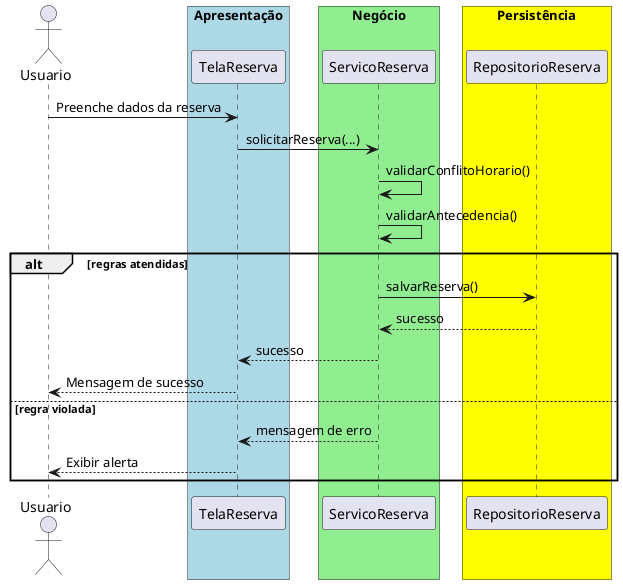

# Trabalho 03 – Sistema de Reserva de Salas de Aula

## Cenário
Uma universidade precisa de um sistema desktop para reservar salas de aula para aulas, reuniões e eventos. O sistema será desenvolvido em **Java**, usando **JavaFX** e a arquitetura em **três camadas**.

## Requisitos Funcionais
| Camada | Funcionalidade |
|--------|----------------|
| **Apresentação (JavaFX)** | Tela de reserva de salas, calendário de disponibilidade e listagem de reservas. |
| **Negócio** | • Validar dados de entrada (data, horário, sala).  • Aplicar as regras de negócio abaixo. |
| **Dados** | • Armazenar salas e reservas em memória (`ArrayList`, `HashMap`).  • Operações CRUD para reservas. |

## Regras de Negócio (2)
1. **Conflito de Horário** – Uma sala não pode ser reservada para dois eventos simultâneos. Se houver sobreposição de horário, a operação deve ser abortada e o usuário deve receber uma mensagem de erro indicando conflito de reserva.
2. **Antecedência Mínima** – Reservas só podem ser feitas com antecedência mínima de **1 hora** em relação ao horário de início. Caso a reserva seja solicitada com menos de 1 hora de antecedência, a operação deve ser interrompida e o usuário avisado.

## Fluxo de Comunicação Entre as Camadas
1. Usuário preenche o formulário de reserva na interface JavaFX.  
2. A camada de apresentação envia os dados ao **Serviço de Reserva** (camada de negócio).  
3. O serviço valida as duas regras; se válidas, delega ao **Repositório de Reservas** (camada de dados). Caso contrário, devolve mensagem de erro.  
4. A camada de apresentação captura a mensagem e a exibe em um `Alert`.

### Diagrama de Sequência

## Barema de Avaliação (100 pontos)
| Área | Peso | Critérios |
|------|------|-----------|
| **Interface Gráfica (JavaFX)** | 20 pts | Funcionalidade completa, usabilidade, mensagens de erro claras. |
| **Camada de Negócio** | 30 pts | Implementação correta das duas regras, tratamento adequado das violações. |
| **Camada de Dados** | 20 pts | Uso adequado de coleções, CRUD funcionando. |
| **Separação em Camadas** | 20 pts | Arquitetura limpa, comunicação correta. |
| **Boas Práticas** | 10 pts | Código legível, nomes coerentes, organização. |

## Entregáveis
1. Projeto Java completo (Maven/Gradle) com pacotes `presentation`, `business`, `data` e `model`.  
2. **README** com instruções de compilação e execução.  
3. Diagrama de classes (UML) mostrando as entidades (`Sala`, `Reserva`).  
4. Diagrama de sequência (como acima) para o caso de uso **Registrar Reserva**.  
5. **Testes unitários** (JUnit) que comprovem:
   - Reserva bem‑sucedida quando não há conflito e antecedência mínima atendida.
   - Falha ao tentar reservar sala já ocupada no mesmo horário.
   - Falha ao reservar com menos de 1 hora de antecedência.