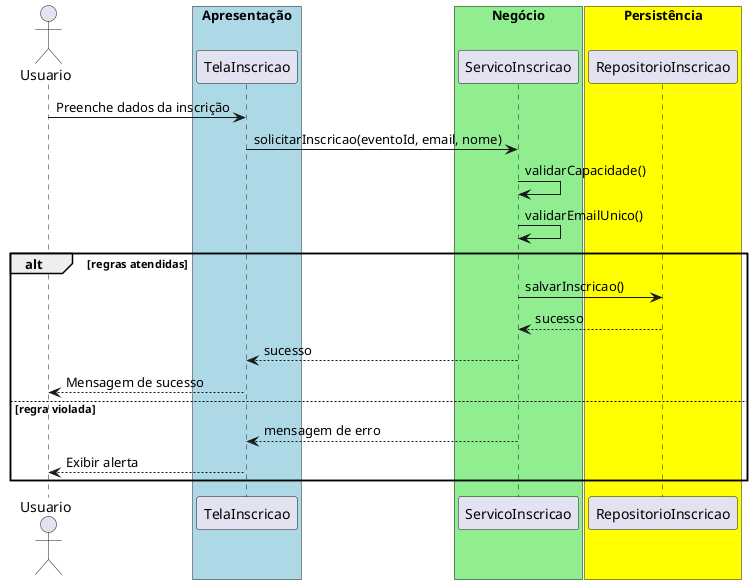

# Trabalho 04 – Sistema de Gerenciamento de Eventos (Inscrição de Participantes)

## Cenário
Uma organização de eventos precisa de um sistema desktop para cadastrar eventos, abrir inscrições e gerenciar a lista de participantes. O sistema será desenvolvido em **Java**, usando **JavaFX** e a arquitetura em **três camadas**.

## Requisitos Funcionais
| Camada | Funcionalidade |
|--------|----------------|
| **Apresentação (JavaFX)** | Tela de cadastro de eventos, tela de inscrição de participantes e listagem de inscritos. |
| **Negócio** | • Validar dados de entrada (nome do evento, data, e‑mail).  • Aplicar as regras de negócio abaixo. |
| **Dados** | • Armazenar eventos e inscrições em memória (`ArrayList`).  • Operações CRUD para eventos e participantes. |

## Regras de Negócio (2)
1. **Capacidade Máxima do Evento** – Cada evento tem um número máximo de vagas. Quando a quantidade de inscrições atingir esse limite, novas inscrições devem ser rejeitadas e o usuário informado que o evento está lotado.
2. **E‑mail Único por Evento** – Um participante não pode se inscrever duas vezes no mesmo evento usando o mesmo endereço de e‑mail. Caso isso ocorra, a operação deve ser abortada e o usuário avisado que o e‑mail já está cadastrado para o evento.

## Fluxo de Comunicação Entre as Camadas
1. Usuário preenche o formulário de inscrição na interface JavaFX.  
2. A **Camada de Apresentação** envia os dados ao **Serviço de Inscrição** (camada de negócio).  
3. O serviço verifica as duas regras; se válidas, delega ao **Repositório de Inscrições** (camada de dados). Caso contrário, devolve uma mensagem de erro.  
4. A **Camada de Apresentação** captura a mensagem e a exibe em um `Alert`.

### Diagrama de Sequência

## Barema de Avaliação (100 pontos)
| Área | Peso | Critérios |
|------|------|-----------|
| **Interface Gráfica (JavaFX)** | 20 pts | Funcionalidade completa, usabilidade, mensagens de erro claras. |
| **Camada de Negócio** | 30 pts | Implementação correta das duas regras, tratamento adequado das violações. |
| **Camada de Dados** | 20 pts | Uso adequado de `ArrayList`, CRUD funcionando. |
| **Separação em Camadas** | 20 pts | Arquitetura limpa, comunicação correta entre as camadas. |
| **Boas Práticas** | 10 pts | Código legível, nomes coerentes, organização de pacotes. |

## Entregáveis
1. Projeto Java completo (Maven/Gradle) com os pacotes `presentation`, `business`, `data` e `model`.  
2. **README** com instruções de compilação e execução.  
3. Diagrama de classes (UML) mostrando as entidades (`Evento`, `Participante`).  
4. Diagrama de sequência (como acima) para o caso de uso **Registrar Inscrição**.  
5. **Testes unitários** (JUnit) que comprovem:
   - Inscrição bem‑sucedida quando há vagas e e‑mail ainda não cadastrado.
   - Falha ao inscrever quando o evento está lotado.
   - Falha ao inscrever o mesmo e‑mail duas vezes no mesmo evento.