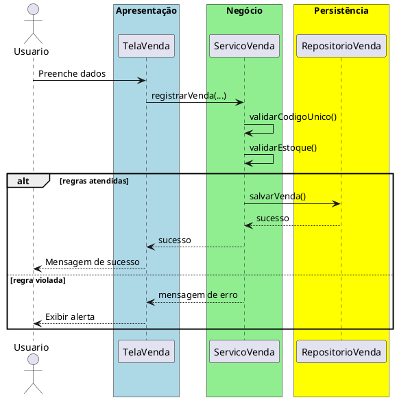

# Trabalho 05 – Sistema de Controle de Vendas (Cadastro de Produtos e Vendas)

## Cenário
Uma loja de varejo precisa de um sistema desktop para cadastrar produtos, registrar vendas e gerar relatórios simples. O desenvolvimento será em **Java**, usando **JavaFX** e a arquitetura em **três camadas**.

## Requisitos Funcionais
| Camada | Funcionalidade |
|--------|----------------|
| **Apresentação (JavaFX)** | Tela de cadastro de produtos, tela de registro de venda e relatório de vendas. |
| **Negócio** | • Validar dados de entrada (código, preço, quantidade).  • Aplicar as regras de negócio abaixo. |
| **Dados** | • Armazenar produtos e vendas em memória (`ArrayList`).  • Operações CRUD para produtos e vendas. |

## Regras de Negócio (2)
1. **Código Único do Produto** – Cada produto deve ter um código alfanumérico único. Se o usuário tentar cadastrar um produto com código já existente, a operação deve ser abortada e o usuário deve receber uma mensagem de erro.
2. **Estoque Suficiente para Venda** – Ao registrar uma venda, a quantidade vendida não pode exceder o estoque disponível. Caso a quantidade solicitada seja maior que o estoque, a operação deve ser interrompida e o usuário deve ser avisado que há estoque insuficiente.

## Fluxo de Comunicação Entre as Camadas
1. Usuário preenche o formulário de cadastro ou venda na interface JavaFX.  
2. A camada de apresentação envia os dados ao **Serviço de Vendas** (camada de negócio).  
3. O serviço valida as duas regras; se válidas, delega ao **Repositório de Vendas** (camada de dados). Caso contrário, devolve mensagem de erro.  
4. A camada de apresentação captura a mensagem e a exibe em um `Alert`.

### Diagrama de Sequência

## Barema de Avaliação (100 pontos)
| Área | Peso | Critérios |
|------|------|-----------|
| **Interface Gráfica (JavaFX)** | 20 pts | Funcionalidade completa, usabilidade, mensagens de erro claras. |
| **Camada de Negócio** | 30 pts | Implementação correta das duas regras, tratamento adequado das violações. |
| **Camada de Dados** | 20 pts | Uso adequado de `ArrayList`, CRUD funcionando. |
| **Separação em Camadas** | 20 pts | Arquitetura limpa, comunicação correta. |
| **Boas Práticas** | 10 pts | Código legível, nomes coerentes, organização. |

## Entregáveis
1. Projeto Java completo (Maven/Gradle) com os pacotes `presentation`, `business`, `data` e `model`.  
2. **README** com instruções de compilação e execução.  
3. Diagrama de classes (UML) mostrando as entidades (`Produto`, `Venda`).  
4. Diagrama de sequência (como acima) para o caso de uso **Registrar Venda**.  
5. **Testes unitários** (JUnit) que comprovem sucesso quando as regras são atendidas e falha quando cada regra é violada.