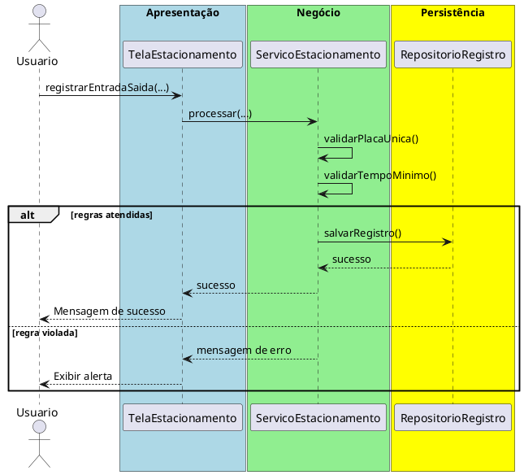

# Trabalho 06 – Sistema de Controle de Estacionamento

## Cenário
Um condomínio deseja um sistema desktop para gerenciar vagas de estacionamento, registrar entrada e saída de veículos e cobrar tarifas. O desenvolvimento será em **Java**, usando **JavaFX** e a arquitetura em **três camadas**.

## Requisitos Funcionais
| Camada | Funcionalidade |
|--------|----------------|
| **Apresentação (JavaFX)** | Tela de registro de entrada/saída, listagem de vagas ocupadas e cálculo de tarifa. |
| **Negócio** | • Validar dados (placa, horário).  • Aplicar as regras de negócio abaixo. |
| **Dados** | • Armazenar veículos e registros em memória (`ArrayList`).  • Operações CRUD para vagas e registros. |

## Regras de Negócio (2)
1. **Placa Única por Vaga** – Uma placa não pode ser registrada em duas vagas simultaneamente. Se houver tentativa de registrar a mesma placa em outra vaga, a operação deve ser abortada e o usuário avisado.
2. **Tempo Mínimo de Permanência** – O tempo de permanência não pode ser inferior a **15 minutos**. Caso o usuário registre saída antes desse intervalo, a operação deve ser interrompida e exibida mensagem de erro.

## Fluxo de Comunicação Entre as Camadas
1. Usuário registra entrada/saída na interface JavaFX.  
2. A camada de apresentação envia os dados ao **Serviço de Estacionamento** (negócio).  
3. O serviço valida as duas regras; se válidas, delega ao **Repositório de Registros** (dados). Caso contrário, devolve mensagem de erro.  
4. A camada de apresentação captura a mensagem e a exibe em um `Alert`.

### Diagrama de Sequência

## Barema de Avaliação (100 pontos)
| Área | Peso | Critérios |
|------|------|-----------|
| **Interface Gráfica** | 20 pts | Funcionalidade completa, usabilidade, mensagens de erro claras. |
| **Camada de Negócio** | 30 pts | Implementação correta das duas regras, tratamento adequado das violações. |
| **Camada de Dados** | 20 pts | Uso adequado de coleções, CRUD funcionando. |
| **Separação em Camadas** | 20 pts | Arquitetura limpa, comunicação correta. |
| **Boas Práticas** | 10 pts | Código legível, nomes coerentes, organização. |

## Entregáveis
1. Projeto Java completo (Maven/Gradle) com pacotes `presentation`, `business`, `data` e `model`.
2. **README** com instruções de compilação e execução.
3. Diagrama de classes (UML) mostrando as entidades (`Vaga`, `Registro`).
4. Diagrama de sequência (acima) para o caso de uso **Registrar Entrada/Saída**.
5. **Testes unitários** (JUnit) que comprovem:
   - Entrada bem‑sucedida quando a placa está livre.
   - Falha ao registrar a mesma placa em outra vaga.
   - Falha ao registrar saída antes de 15 minutos.