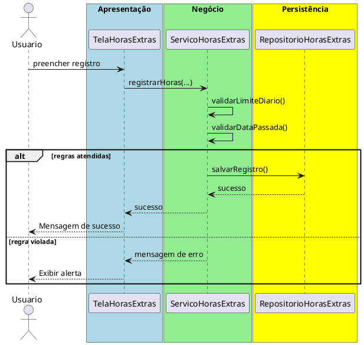

# Trabalho 07 – Sistema de Controle de Horas Extras

## Cenário
Uma empresa deseja um sistema desktop para registrar horas extras dos funcionários, validar limites e gerar relatórios. O desenvolvimento será em **Java**, usando **JavaFX** e a arquitetura em **três camadas**.

## Requisitos Funcionais
| Camada | Funcionalidade |
|--------|----------------|
| **Apresentação (JavaFX)** | Tela de registro de horas extras, listagem de registros e relatório por funcionário. |
| **Negócio** | • Validar dados (código do funcionário, data, horas).  • Aplicar as regras de negócio abaixo. |
| **Dados** | • Armazenar registros em memória (`ArrayList`).  • Operações CRUD para registros de horas extras. |

## Regras de Negócio (2)
1. **Limite Diário de Horas Extras** – Um funcionário não pode registrar mais de **4 horas** extras em um mesmo dia. Se a soma ultrapassar esse limite, a operação deve ser abortada e o usuário avisado.
2. **Data Não Futurista** – A data do registro não pode ser posterior ao dia atual. Caso seja, a operação deve ser interrompida e o usuário receber uma mensagem de erro.

## Fluxo de Comunicação Entre as Camadas
1. Usuário preenche o formulário de registro na interface JavaFX.  
2. A camada de apresentação envia os dados ao **Serviço de Horas Extras** (negócio).  
3. O serviço valida as duas regras; se válidas, delega ao **Repositório de Registros** (dados). Caso contrário, devolve mensagem de erro.  
4. A camada de apresentação captura a mensagem e a exibe em um `Alert`.

### Diagrama de Sequência

## Barema de Avaliação (100 pontos)
| Área | Peso | Critérios |
|------|------|-----------|
| **Interface Gráfica** | 20 pts | Funcionalidade completa, usabilidade, mensagens de erro claras. |
| **Camada de Negócio** | 30 pts | Implementação correta das duas regras, tratamento adequado das violações. |
| **Camada de Dados** | 20 pts | Uso adequado de `ArrayList`, CRUD funcionando. |
| **Separação em Camadas** | 20 pts | Arquitetura limpa, comunicação correta. |
| **Boas Práticas** | 10 pts | Código legível, nomes coerentes, organização. |

## Entregáveis
1. Projeto Java completo (Maven/Gradle) com pacotes `presentation`, `business`, `data` e `model`.
2. **README** com instruções de compilação e execução.
3. Diagrama de classes (UML) mostrando as entidades (`Funcionario`, `HorasExtras`).
4. Diagrama de sequência (acima) para o caso de uso **Registrar Horas Extras**.
5. **Testes unitários** (JUnit) que comprovem sucesso quando as regras são atendidas e falha nas duas situações de violação.