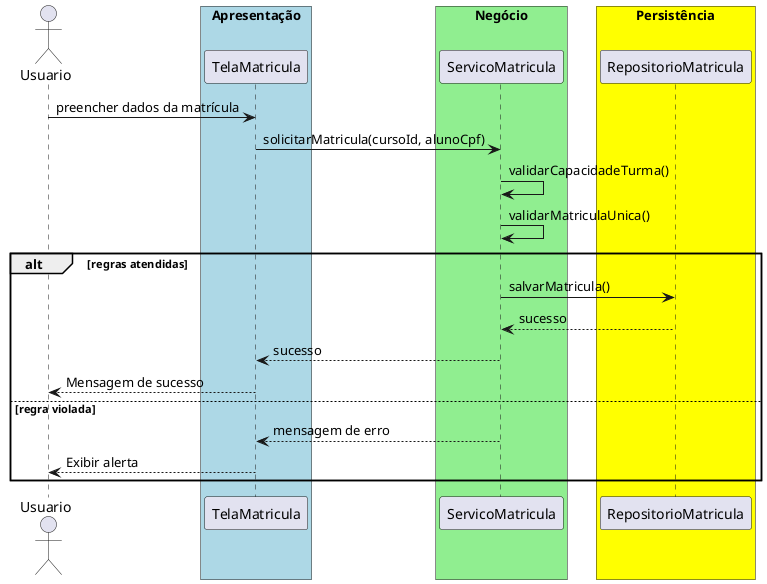

# Trabalho 08 – Sistema de Gerenciamento de Cursos (Matrícula de Alunos)

## Cenário
Uma instituição de ensino precisa de um sistema desktop para cadastrar cursos, abrir matrículas e controlar a quantidade de alunos por curso. O desenvolvimento será em **Java**, usando **JavaFX** e a arquitetura em **três camadas**.

## Requisitos Funcionais
| Camada | Funcionalidade |
|--------|----------------|
| **Apresentação (JavaFX)** | Tela de cadastro de cursos, tela de matrícula de alunos e listagem de turmas. |
| **Negócio** | • Validar dados de entrada (código do curso, nome do aluno, CPF).  • Aplicar as regras de negócio abaixo. |
| **Dados** | • Armazenar cursos e matrículas em memória (`ArrayList`, `HashMap`).  • Operações CRUD para cursos e matrículas. |

## Regras de Negócio (2)
1. **Capacidade Máxima da Turma** – Cada curso tem um número máximo de vagas (ex.: 30). Quando a quantidade de matrículas atingir esse limite, novas matrículas devem ser rejeitadas e o usuário informado que a turma está completa.
2. **Matrícula Única por Aluno** – Um aluno não pode se matricular duas vezes no mesmo curso. Caso a tentativa ocorra, a operação deve ser abortada e o usuário avisado que o aluno já está matriculado.

## Fluxo de Comunicação Entre as Camadas
1. Usuário preenche o formulário de matrícula na interface JavaFX.  
2. A **Camada de Apresentação** envia os dados ao **Serviço de Matrícula** (camada de negócio).  
3. O serviço verifica as duas regras; se válidas, delega ao **Repositório de Matrículas** (camada de dados). Caso contrário, devolve uma mensagem de erro.  
4. A **Camada de Apresentação** captura a mensagem e a exibe em um `Alert`.

### Diagrama de Sequência

## Barema de Avaliação (100 pontos)
| Área | Peso | Critérios |
|------|------|-----------|
| **Interface Gráfica (JavaFX)** | 20 pts | Funcionalidade completa, usabilidade, mensagens de erro claras. |
| **Camada de Negócio** | 30 pts | Implementação correta das duas regras, tratamento adequado das violações. |
| **Camada de Dados** | 20 pts | Uso adequado de coleções, CRUD funcionando. |
| **Separação em Camadas** | 20 pts | Arquitetura limpa, comunicação correta. |
| **Boas Práticas** | 10 pts | Código legível, nomes coerentes, organização. |

## Entregáveis
1. Projeto Java completo (Maven/Gradle) com os pacotes `presentation`, `business`, `data` e `model`.  
2. **README** com instruções de compilação e execução.  
3. Diagrama de classes (UML) mostrando as entidades (`Curso`, `Aluno`, `Matricula`).  
4. Diagrama de sequência (como acima) para o caso de uso **Registrar Matrícula**.  
5. **Testes unitários** (JUnit) que comprovem:
   - Matrícula bem‑sucedida quando há vagas e o aluno ainda não está matriculado.
   - Falha ao tentar matricular quando a turma está completa.
   - Falha ao matricular o mesmo aluno duas vezes no mesmo curso.