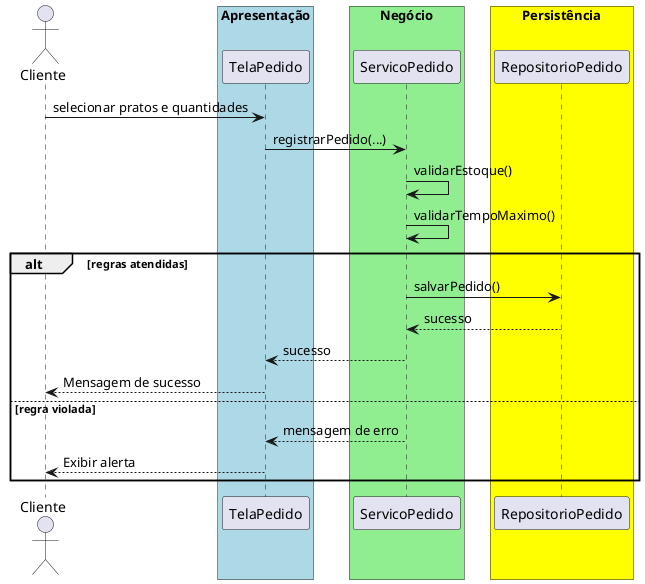

# Trabalho 09 – Sistema de Gerenciamento de Pedidos (Restaurante)

## Cenário
Um restaurante deseja um sistema desktop para cadastrar pratos, receber pedidos dos clientes e controlar o status de preparo. O desenvolvimento será em **Java**, usando **JavaFX** e a arquitetura em **três camadas**.

## Requisitos Funcionais
| Camada | Funcionalidade |
|--------|----------------|
| **Apresentação (JavaFX)** | Tela de cadastro de pratos, tela de criação de pedidos e visualização do status (preparando, pronto, entregue). |
| **Negócio** | • Validar dados de entrada (nome do prato, preço, quantidade).  • Aplicar as regras de negócio abaixo. |
| **Dados** | • Armazenar pratos e pedidos em memória (`ArrayList`).  • Operações CRUD para pratos e pedidos. |

## Regras de Negócio (2)
1. **Quantidade Disponível do Prato** – Cada prato tem um estoque de porções disponíveis. Ao registrar um pedido, a quantidade solicitada não pode exceder o estoque. Se exceder, a operação deve ser abortada e o usuário deve receber uma mensagem de erro indicando estoque insuficiente.
2. **Tempo Máximo de Preparação** – O tempo total de preparo de um pedido não pode ultrapassar **45 minutos**. Caso a soma dos tempos estimados dos pratos do pedido exceda esse limite, a operação deve ser interrompida e o usuário avisado.

## Fluxo de Comunicação Entre as Camadas
1. Usuário cria um pedido na interface JavaFX.  
2. A camada de apresentação envia os dados ao **Serviço de Pedidos** (camada de negócio).  
3. O serviço valida as duas regras; se válidas, delega ao **Repositório de Pedidos** (camada de dados). Caso contrário, devolve mensagem de erro.  
4. A camada de apresentação captura a mensagem e a exibe em um `Alert`.

### Diagrama de Sequência

## Barema de Avaliação (100 pontos)
| Área | Peso | Critérios |
|------|------|-----------|
| **Interface Gráfica (JavaFX)** | 20 pts | Funcionalidade completa, usabilidade, mensagens de erro claras. |
| **Camada de Negócio** | 30 pts | Implementação correta das duas regras, tratamento adequado das violações. |
| **Camada de Dados** | 20 pts | Uso adequado de `ArrayList`, CRUD funcionando. |
| **Separação em Camadas** | 20 pts | Arquitetura limpa, comunicação correta. |
| **Boas Práticas** | 10 pts | Código legível, nomes coerentes, organização. |

## Entregáveis
1. Projeto Java completo (Maven/Gradle) com os pacotes `presentation`, `business`, `data` e `model`.  
2. **README** com instruções de compilação e execução.  
3. Diagrama de classes (UML) mostrando as entidades (`Prato`, `Pedido`).  
4. Diagrama de sequência (como acima) para o caso de uso **Registrar Pedido**.  
5. **Testes unitários** (JUnit) que comprovem:
   - Pedido bem‑sucedido quando há estoque suficiente e tempo dentro do limite.
   - Falha ao solicitar quantidade maior que o estoque.
   - Falha ao ultrapassar o tempo máximo de preparação.