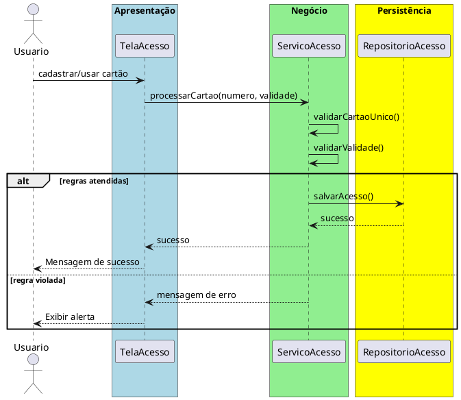

# Trabalho 10 – Sistema de Controle de Acesso – Cartões RFID

## Cenário
Uma empresa deseja controlar o acesso de funcionários e visitantes a áreas restritas usando cartões RFID. O sistema será desenvolvido em **Java**, com interface **JavaFX** e arquitetura em **três camadas**.

## Requisitos Funcionais
| Camada | Funcionalidade |
|--------|----------------|
| **Apresentação (JavaFX)** | Tela de cadastro de cartões, tela de registro de entrada/saída e relatório de acessos. |
| **Negócio** | • Validar dados (número do cartão, data de validade).  • Aplicar as regras de negócio abaixo. |
| **Dados** | • Armazenar cartões e registros em memória (`ArrayList`).  • Operações CRUD para cartões e acessos. |

## Regras de Negócio (2)
1. **Cartão Único** – Cada número de cartão RFID deve ser único no sistema. Se houver tentativa de cadastrar um número já existente, a operação deve ser abortada e o usuário avisado.
2. **Validade do Cartão** – Um cartão só pode ser usado para registrar acesso se a data de validade for posterior à data atual. Caso contrário, a operação deve ser interrompida e o usuário receberá uma mensagem de erro.

## Fluxo de Comunicação Entre as Camadas
1. Usuário cadastra ou utiliza um cartão na interface JavaFX.  
2. A camada de apresentação envia os dados ao **Serviço de Acesso** (camada de negócio).  
3. O serviço valida as duas regras; se válidas, delega ao **Repositório de Acessos** (camada de dados). Caso contrário, devolve mensagem de erro.  
4. A camada de apresentação captura a mensagem e a exibe em um `Alert`.

### Diagrama de Sequência

## Barema de Avaliação (100 pontos)
| Área | Peso | Critérios |
|------|------|-----------|
| **Interface Gráfica (JavaFX)** | 20 pts | Funcionalidade completa, usabilidade, mensagens de erro claras. |
| **Camada de Negócio** | 30 pts | Implementação correta das duas regras, tratamento adequado das violações. |
| **Camada de Dados** | 20 pts | Uso adequado de `ArrayList`, CRUD funcionando. |
| **Separação em Camadas** | 20 pts | Arquitetura limpa, comunicação correta. |
| **Boas Práticas** | 10 pts | Código legível, nomes coerentes, organização. |

## Entregáveis
1. Projeto Java completo (Maven/Gradle) com os pacotes `presentation`, `business`, `data` e `model`.
2. **README** com instruções de compilação e execução.
3. Diagrama de classes (UML) mostrando as entidades (`Cartao`, `Acesso`).
4. Diagrama de sequência (acima) para o caso de uso **Registrar Acesso**.
5. **Testes unitários** (JUnit) que comprovem:
   - Cadastro bem‑sucedido com número de cartão único.
   - Falha ao cadastrar número duplicado.
   - Falha ao registrar acesso com cartão expirado.