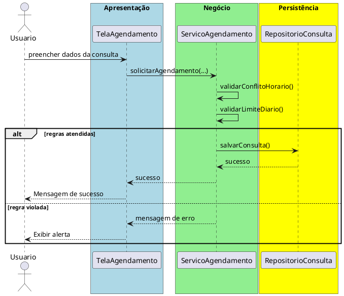

# Trabalho 12 – Sistema de Gerenciamento de Saúde – Agendamento de Consultas

## Cenário
Uma clínica médica precisa de um sistema desktop para agendar consultas, gerenciar pacientes e controlar a disponibilidade de médicos. O desenvolvimento será em **Java**, usando **JavaFX** e a arquitetura em **três camadas**.

## Requisitos Funcionais
| Camada | Funcionalidade |
|--------|----------------|
| **Apresentação (JavaFX)** | Tela de cadastro de pacientes, tela de agendamento de consultas e calendário de disponibilidade dos médicos. |
| **Negócio** | • Validar dados (CPF, data da consulta, horário).  • Aplicar as regras de negócio abaixo. |
| **Dados** | • Armazenar pacientes, médicos e consultas em memória (`ArrayList`).  • Operações CRUD para todas as entidades. |

## Regras de Negócio (2)
1. **Conflito de Horário** – Um médico não pode ter duas consultas marcadas para o mesmo horário. Se houver sobreposição, a operação deve ser abortada e o usuário receberá uma mensagem de erro indicando conflito de agenda.
2. **Limite Diário de Pacientes** – Cada médico pode atender no máximo **20 pacientes** por dia. Caso a soma das consultas ultrapasse esse limite, a operação deve ser interrompida e o usuário avisado que o limite diário foi atingido.

## Fluxo de Comunicação Entre as Camadas
1. Usuário agenda uma consulta na interface JavaFX.  
2. A camada de apresentação envia os dados ao **Serviço de Agendamento** (camada de negócio).  
3. O serviço valida as duas regras; se válidas, delega ao **Repositório de Consultas** (camada de dados). Caso contrário, devolve mensagem de erro.  
4. A camada de apresentação captura a mensagem e a exibe em um `Alert`.

### Diagrama de Sequência

## Barema de Avaliação (100 pontos)
| Área | Peso | Critérios |
|------|------|-----------|
| **Interface Gráfica (JavaFX)** | 20 pts | Funcionalidade completa, usabilidade, mensagens de erro claras. |
| **Camada de Negócio** | 30 pts | Implementação correta das duas regras, tratamento adequado das violações. |
| **Camada de Dados** | 20 pts | Uso adequado de coleções, CRUD funcionando. |
| **Separação em Camadas** | 20 pts | Arquitetura limpa, comunicação correta. |
| **Boas Práticas** | 10 pts | Código legível, nomes coerentes, organização. |

## Entregáveis
1. Projeto Java completo (Maven/Gradle) com os pacotes `presentation`, `business`, `data` e `model`.  
2. **README** com instruções de compilação e execução.  
3. Diagrama de classes (UML) mostrando as entidades (`Paciente`, `Medico`, `Consulta`).  
4. Diagrama de sequência (acima) para o caso de uso **Agendar Consulta**.  
5. **Testes unitários** (JUnit) que comprovem:
   - Agendamento bem‑sucedido quando não há conflito e limite diário não ultrapassado.
   - Falha ao agendar horário já ocupado.
   - Falha ao ultrapassar 20 consultas diárias para o mesmo médico.