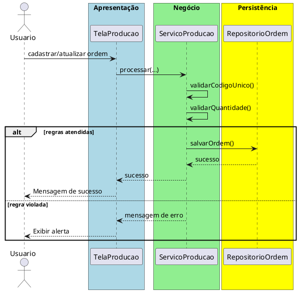

# Trabalho 14 – Sistema de Controle de Produção – Ordem de Fabricação

## Cenário
Uma indústria precisa de um sistema desktop para registrar ordens de fabricação, acompanhar o status de produção e gerar relatórios de eficiência. O desenvolvimento será em **Java**, usando **JavaFX** e a arquitetura em **três camadas**.

## Requisitos Funcionais
| Camada | Funcionalidade |
|--------|----------------|
| **Apresentação (JavaFX)** | Tela de cadastro de ordem de produção, tela de atualização de status (em produção, concluída, cancelada) e relatório de produtividade. |
| **Negócio** | • Validar dados (código da ordem, quantidade, data de início).  • Aplicar as regras de negócio abaixo. |
| **Dados** | • Armazenar ordens em memória (`ArrayList`).  • Operações CRUD para ordens de produção. |

## Regras de Negócio (2)
1. **Código Único da Ordem** – Cada ordem de fabricação deve possuir um código alfanumérico único. Caso o usuário tente cadastrar uma ordem com código já existente, a operação deve ser abortada e o usuário avisado.
2. **Quantidade Positiva** – A quantidade de unidades a produzir deve ser maior que zero. Se for informado zero ou número negativo, a operação deve ser interrompida e o usuário receberá uma mensagem de erro.

## Fluxo de Comunicação Entre as Camadas
1. Usuário cadastra ou atualiza uma ordem na interface JavaFX.  
2. A camada de apresentação envia os dados ao **Serviço de Produção** (camada de negócio).  
3. O serviço valida as duas regras; se válidas, delega ao **Repositório de Ordens** (camada de dados). Caso contrário, devolve mensagem de erro.  
4. A camada de apresentação captura a mensagem e a exibe em um `Alert`.

### Diagrama de Sequência

## Barema de Avaliação (100 pontos)
| Área | Peso | Critérios |
|------|------|-----------|
| **Interface Gráfica (JavaFX)** | 20 pts | Funcionalidade completa, usabilidade, mensagens de erro claras. |
| **Camada de Negócio** | 30 pts | Implementação correta das duas regras, tratamento adequado das violações. |
| **Camada de Dados** | 20 pts | Uso adequado de `ArrayList`, CRUD funcionando. |
| **Separação em Camadas** | 20 pts | Arquitetura limpa, comunicação correta. |
| **Boas Práticas** | 10 pts | Código legível, nomes coerentes, organização. |

## Entregáveis
1. Projeto Java completo (Maven/Gradle) com os pacotes `presentation`, `business`, `data` e `model`.  
2. **README** com instruções de compilação e execução.  
3. Diagrama de classes (UML) mostrando a entidade `OrdemProducao`.  
4. Diagrama de sequência (acima) para o caso de uso **Cadastrar/Atualizar Ordem**.  
5. **Testes unitários** (JUnit) que comprovem:
   - Cadastro bem‑sucedido com código único e quantidade positiva.
   - Falha ao cadastrar código duplicado.
   - Falha ao informar quantidade zero ou negativa.