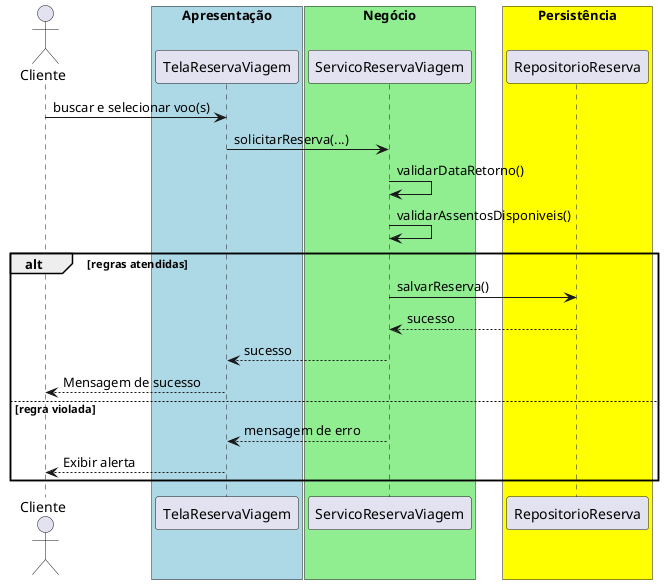

# Trabalho 15 – Sistema de Gerenciamento de Viagens – Reserva de Passagens

## Cenário
Uma agência de viagens deseja um sistema desktop para permitir que clientes reservem passagens aéreas, escolham datas e destinos, e visualizem detalhes da viagem. O desenvolvimento será em **Java**, usando **JavaFX** e a arquitetura em **três camadas**.

## Requisitos Funcionais
| Camada | Funcionalidade |
|--------|----------------|
| **Apresentação (JavaFX)** | Tela de busca de voos, tela de seleção de assentos e confirmação da reserva. |
| **Negócio** | • Validar dados (origem, destino, datas, número de passageiros).  • Aplicar as regras de negócio abaixo. |
| **Dados** | • Armazenar voos disponíveis e reservas em memória (`ArrayList`).  • Operações CRUD para reservas. |

## Regras de Negócio (2)
1. **Data de Retorno Pós‑Ida** – Quando a reserva for de ida e volta, a data de retorno deve ser posterior à data de ida. Caso contrário, a operação deve ser abortada e o usuário receberá uma mensagem de erro.
2. **Capacidade de Assentos** – Cada voo tem um número máximo de assentos. Ao confirmar a reserva, a quantidade de assentos solicitados não pode exceder a disponibilidade. Se exceder, a operação deve ser interrompida e o usuário avisado que não há assentos suficientes.

## Fluxo de Comunicação Entre as Camadas
1. Usuário busca voos e preenche os dados na interface JavaFX.  
2. A camada de apresentação envia os dados ao **Serviço de Reserva** (camada de negócio).  
3. O serviço valida as duas regras; se válidas, delega ao **Repositório de Reservas** (camada de dados). Caso contrário, devolve mensagem de erro.  
4. A camada de apresentação captura a mensagem e a exibe em um `Alert`.

### Diagrama de Sequência

## Barema de Avaliação (100 pontos)
| Área | Peso | Critérios |
|------|------|-----------|
| **Interface Gráfica (JavaFX)** | 20 pts | Funcionalidade completa, usabilidade, mensagens de erro claras. |
| **Camada de Negócio** | 30 pts | Implementação correta das duas regras, tratamento adequado das violações. |
| **Camada de Dados** | 20 pts | Uso adequado de `ArrayList`, CRUD funcionando. |
| **Separação em Camadas** | 20 pts | Arquitetura limpa, comunicação correta. |
| **Boas Práticas** | 10 pts | Código legível, nomes coerentes, organização. |

## Entregáveis
1. Projeto Java completo (Maven/Gradle) com os pacotes `presentation`, `business`, `data` e `model`.  
2. **README** com instruções de compilação e execução.  
3. Diagrama de classes (UML) mostrando as entidades (`Voo`, `ReservaViagem`).  
4. Diagrama de sequência (acima) para o caso de uso **Registrar Reserva de Viagem**.  
5. **Testes unitários** (JUnit) que comprovem:
   - Reserva bem‑sucedida quando a data de retorno é válida e há assentos disponíveis.
   - Falha ao registrar retorno anterior à data de ida.
   - Falha ao reservar mais assentos que a disponibilidade do voo.