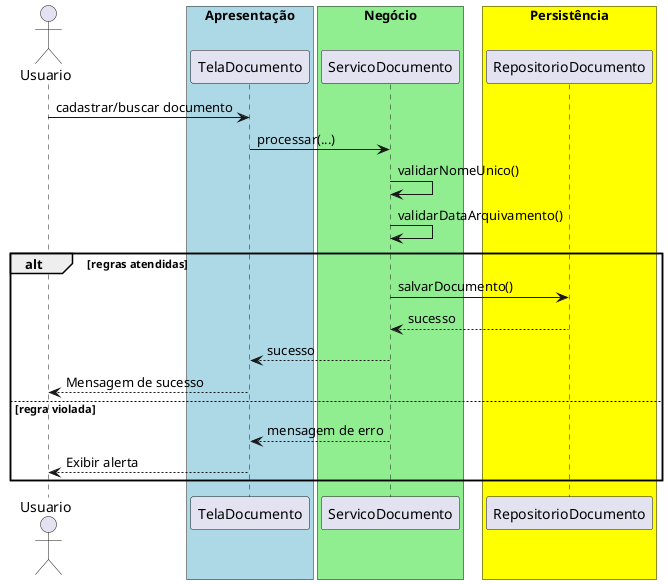

# Trabalho 16 – Sistema de Controle de Documentos – Arquivamento e Busca

## Cenário
Uma empresa precisa de um sistema desktop para arquivar documentos digitais, organizar metadados e permitir buscas rápidas. O desenvolvimento será em **Java**, usando **JavaFX** e a arquitetura em **três camadas**.

## Requisitos Funcionais
| Camada | Funcionalidade |
|--------|----------------|
| **Apresentação (JavaFX)** | Tela de cadastro de documentos, tela de busca avançada e listagem de resultados. |
| **Negócio** | • Validar dados (nome, tipo, data de arquivamento).  • Aplicar as regras de negócio abaixo. |
| **Dados** | • Armazenar documentos em memória (`ArrayList`).  • Operações CRUD para documentos e índices de busca. |

## Regras de Negócio (2)
1. **Nome Único do Documento** – Cada documento deve possuir um nome único no sistema. Se o usuário tentar cadastrar um documento com nome já existente, a operação deve ser abortada e o usuário receberá uma mensagem de erro.
2. **Data de Arquivamento Não Futurista** – A data de arquivamento não pode ser posterior à data atual. Caso seja, a operação deve ser interrompida e o usuário receberá uma mensagem de erro.

## Fluxo de Comunicação Entre as Camadas
1. Usuário cadastra ou busca um documento na interface JavaFX.  
2. A camada de apresentação envia os dados ao **Serviço de Documentos** (camada de negócio).  
3. O serviço valida as duas regras; se válidas, delega ao **Repositório de Documentos** (camada de dados). Caso contrário, devolve mensagem de erro.  
4. A camada de apresentação captura a mensagem e a exibe em um `Alert`.

### Diagrama de Sequência

## Barema de Avaliação (100 pontos)
| Área | Peso | Critérios |
|------|------|-----------|
| **Interface Gráfica (JavaFX)** | 20 pts | Funcionalidade completa, usabilidade, mensagens de erro claras. |
| **Camada de Negócio** | 30 pts | Implementação correta das duas regras, tratamento adequado das violações. |
| **Camada de Dados** | 20 pts | Uso adequado de `ArrayList`, CRUD funcionando. |
| **Separação em Camadas** | 20 pts | Arquitetura limpa, comunicação correta. |
| **Boas Práticas** | 10 pts | Código legível, nomes coerentes, organização. |

## Entregáveis
1. Projeto Java completo (Maven/Gradle) com os pacotes `presentation`, `business`, `data` e `model`.  
2. **README** com instruções de compilação e execução.  
3. Diagrama de classes (UML) mostrando a entidade `Documento`.  
4. Diagrama de sequência (acima) para o caso de uso **Cadastrar/Buscar Documento**.  
5. **Testes unitários** (JUnit) que comprovem:
   - Cadastro bem‑sucedido com nome único e data válida.
   - Falha ao cadastrar nome duplicado.
   - Falha ao informar data de arquivamento futura.