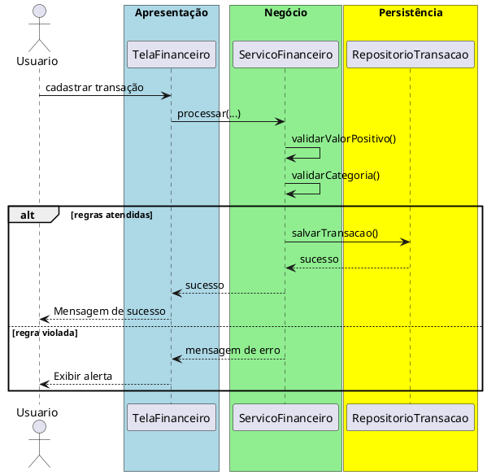

# Trabalho 17 – Sistema de Gerenciamento de Finanças – Despesas e Receitas

## Cenário
Uma pequena empresa precisa de um sistema desktop para registrar transações financeiras, categorizar despesas, acompanhar receitas e gerar relatórios simples. O desenvolvimento será em **Java**, usando **JavaFX** e a arquitetura em **três camadas**.

## Requisitos Funcionais
| Camada | Funcionalidade |
|--------|----------------|
| **Apresentação (JavaFX)** | Tela de cadastro de despesas/receitas, tela de listagem de transações e geração de relatórios financeiros. |
| **Negócio** | • Validar dados (valor, data, categoria).  • Aplicar as regras de negócio abaixo. |
| **Dados** | • Armazenar transações em memória (`ArrayList`).  • Operações CRUD para despesas e receitas. |

## Regras de Negócio (2)
1. **Valor Positivo** – O valor de qualquer despesa ou receita deve ser maior que zero. Caso seja zero ou negativo, a operação deve ser abortada e o usuário receberá uma mensagem de erro.
2. **Categoria Obrigatória** – Cada transação deve ter uma categoria selecionada (ex.: "Alimentação", "Salário", "Serviços"). Se a categoria não for informada, a operação deve ser interrompida e o usuário será avisado.

## Fluxo de Comunicação Entre as Camadas
1. Usuário cadastra uma despesa ou receita na interface JavaFX.  
2. A camada de apresentação envia os dados ao **Serviço Financeiro** (camada de negócio).  
3. O serviço valida as duas regras; se válidas, delega ao **Repositório de Transações** (camada de dados). Caso contrário, devolve mensagem de erro.  
4. A camada de apresentação captura a mensagem e a exibe em um `Alert`.

### Diagrama de Sequência

## Barema de Avaliação (100 pontos)
| Área | Peso | Critérios |
|------|------|-----------|
| **Interface Gráfica (JavaFX)** | 20 pts | Funcionalidade completa, usabilidade, mensagens de erro claras. |
| **Camada de Negócio** | 30 pts | Implementação correta das duas regras, tratamento adequado das violações. |
| **Camada de Dados** | 20 pts | Uso adequado de `ArrayList`, CRUD funcionando. |
| **Separação em Camadas** | 20 pts | Arquitetura limpa, comunicação correta. |
| **Boas Práticas** | 10 pts | Código legível, nomes coerentes, organização. |

## Entregáveis
1. Projeto Java completo (Maven/Gradle) com os pacotes `presentation`, `business`, `data` e `model`.  
2. **README** com instruções de compilação e execução.  
3. Diagrama de classes (UML) mostrando as entidades (`Transacao`, `Categoria`).  
4. Diagrama de sequência (acima) para o caso de uso **Cadastrar Transação**.  
5. **Testes unitários** (JUnit) que comprovem:
   - Cadastro bem‑sucedido quando valor > 0 e categoria informada.
   - Falha ao cadastrar valor zero ou negativo.
   - Falha ao omitir a categoria.