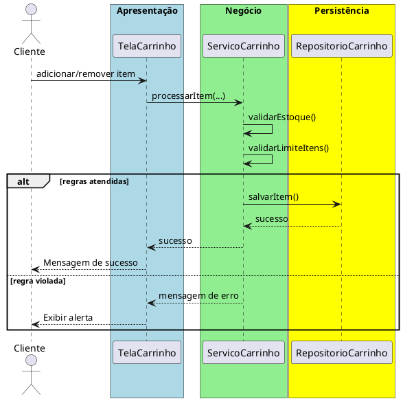

# Trabalho 18 – Sistema de Gerenciamento de Loja – Carrinho de Compras

## Cenário
Uma loja virtual deseja um sistema desktop para gerenciar o carrinho de compras, permitindo que clientes adicionem, removam e atualizem itens antes de finalizar a compra. O desenvolvimento será em **Java**, usando **JavaFX** e a arquitetura em **três camadas**.

## Requisitos Funcionais
| Camada | Funcionalidade |
|--------|----------------|
| **Apresentação (JavaFX)** | Tela de listagem de produtos, tela do carrinho de compras e botão de finalização. |
| **Negócio** | • Validar dados (código do produto, quantidade).  • Aplicar as regras de negócio abaixo. |
| **Dados** | • Armazenar produtos e itens do carrinho em memória (`ArrayList`).  • Operações CRUD para itens do carrinho. |

## Regras de Negócio (2)
1. **Quantidade Disponível no Estoque** – Ao adicionar um item ao carrinho, a quantidade solicitada não pode exceder o estoque disponível do produto. Caso exceda, a operação deve ser abortada e o usuário receberá uma mensagem de erro.
2. **Limite de Itens no Carrinho** – O carrinho não pode conter mais que **20 itens diferentes**. Se o usuário tentar adicionar um novo produto quando o limite já foi atingido, a operação deve ser interrompida e o usuário avisado.

## Fluxo de Comunicação Entre as Camadas
1. Usuário adiciona ou remove itens na interface JavaFX.  
2. A camada de apresentação envia os dados ao **Serviço de Carrinho** (camada de negócio).  
3. O serviço valida as duas regras; se válidas, delega ao **Repositório de Carrinho** (camada de dados). Caso contrário, devolve mensagem de erro.  
4. A camada de apresentação captura a mensagem e a exibe em um `Alert`.

### Diagrama de Sequência

## Barema de Avaliação (100 pontos)
| Área | Peso | Critérios |
|------|------|-----------|
| **Interface Gráfica (JavaFX)** | 20 pts | Funcionalidade completa, usabilidade, mensagens de erro claras. |
| **Camada de Negócio** | 30 pts | Implementação correta das duas regras, tratamento adequado das violações. |
| **Camada de Dados** | 20 pts | Uso adequado de `ArrayList`, CRUD funcionando. |
| **Separação em Camadas** | 20 pts | Arquitetura limpa, comunicação correta. |
| **Boas Práticas** | 10 pts | Código legível, nomes coerentes, organização. |

## Entregáveis
1. Projeto Java completo (Maven/Gradle) com os pacotes `presentation`, `business`, `data` e `model`.  
2. **README** com instruções de compilação e execução.  
3. Diagrama de classes (UML) mostrando as entidades (`Produto`, `ItemCarrinho`).  
4. Diagrama de sequência (acima) para o caso de uso **Adicionar/Remover Item do Carrinho**.  
5. **Testes unitários** (JUnit) que comprovem:
   - Adição bem‑sucedida quando há estoque suficiente e limite de itens não ultrapassado.
   - Falha ao adicionar quantidade maior que o estoque.
   - Falha ao exceder 20 itens diferentes no carrinho.