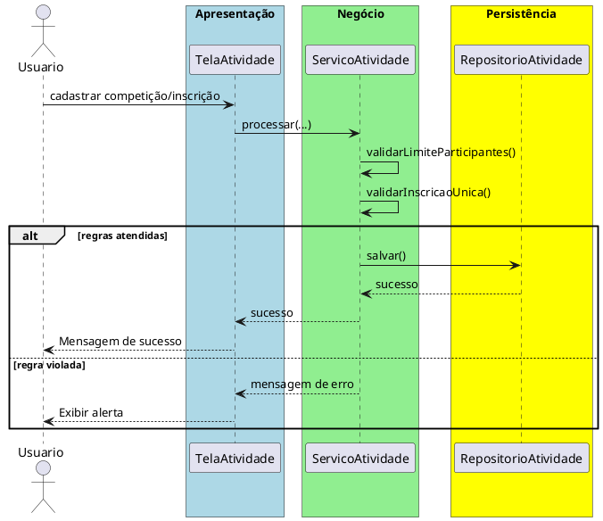

# Trabalho 19 – Sistema de Gerenciamento de Atividades Esportivas – Inscrição e Resultados

## Cenário
Uma federação esportiva deseja um sistema desktop para gerenciar a inscrição de atletas em competições, registrar resultados e publicar classificações. O desenvolvimento será em **Java**, usando **JavaFX** e a arquitetura em **três camadas**.

## Requisitos Funcionais
| Camada | Funcionalidade |
|--------|----------------|
| **Apresentação (JavaFX)** | Tela de cadastro de competições, tela de inscrição de atletas e visualização de resultados/classificação. |
| **Negócio** | • Validar dados (nome da competição, data, categoria do atleta).  • Aplicar as regras de negócio abaixo. |
| **Dados** | • Armazenar competições, inscrições e resultados em memória (`ArrayList`).  • Operações CRUD para todas as entidades. |

## Regras de Negócio (2)
1. **Limite de Participantes por Competição** – Cada competição tem um número máximo de atletas (ex.: 30). Quando o limite for atingido, novas inscrições devem ser rejeitadas e o usuário informado que a competição está completa.
2. **Inscrição Única por Atleta** – Um atleta não pode se inscrever duas vezes na mesma competição. Caso a tentativa ocorra, a operação deve ser abortada e o usuário avisado que o atleta já está inscrito.

## Fluxo de Comunicação Entre as Camadas
1. Usuário cadastra uma competição ou inscreve um atleta na interface JavaFX.  
2. A camada de apresentação envia os dados ao **Serviço de Atividades Esportivas** (camada de negócio).  
3. O serviço valida as duas regras; se válidas, delega ao **Repositório de Atividades** (camada de dados). Caso contrário, devolve mensagem de erro.  
4. A camada de apresentação captura a mensagem e a exibe em um `Alert`.

### Diagrama de Sequência

## Barema de Avaliação (100 pontos)
| Área | Peso | Critérios |
|------|------|-----------|
| **Interface Gráfica (JavaFX)** | 20 pts | Funcionalidade completa, usabilidade, mensagens de erro claras. |
| **Camada de Negócio** | 30 pts | Implementação correta das duas regras, tratamento adequado das violações. |
| **Camada de Dados** | 20 pts | Uso adequado de `ArrayList`, CRUD funcionando. |
| **Separação em Camadas** | 20 pts | Arquitetura limpa, comunicação correta. |
| **Boas Práticas** | 10 pts | Código legível, nomes coerentes, organização. |

## Entregáveis
1. Projeto Java completo (Maven/Gradle) com os pacotes `presentation`, `business`, `data` e `model`.  
2. **README** com instruções de compilação e execução.  
3. Diagrama de classes (UML) mostrando as entidades (`Competicao`, `Atleta`, `Inscricao`).  
4. Diagrama de sequência (acima) para o caso de uso **Cadastrar Inscrição**.  
5. **Testes unitários** (JUnit) que comprovem:
   - Inscrição bem‑sucedida quando há vagas e atleta ainda não inscrito.
   - Falha ao tentar inscrever quando a competição está completa.
   - Falha ao inscrever o mesmo atleta duas vezes na mesma competição.