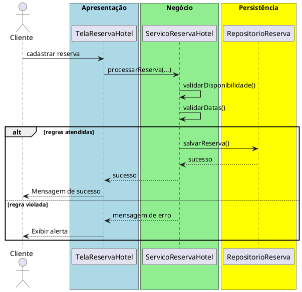

# Trabalho 20 – Sistema de Gerenciamento de Hotel – Reservas de Quartos

## Cenário
Um hotel deseja um sistema desktop para gerenciar reservas de quartos, controlar disponibilidade e registrar hóspedes. O desenvolvimento será em **Java**, usando **JavaFX** e a arquitetura em **três camadas**.

## Requisitos Funcionais
| Camada | Funcionalidade |
|--------|----------------|
| **Apresentação (JavaFX)** | Tela de cadastro de hóspedes, tela de reserva de quartos e calendário de ocupação. |
| **Negócio** | • Validar dados (nome do hóspede, data de check‑in/check‑out, tipo de quarto).  • Aplicar as regras de negócio abaixo. |
| **Dados** | • Armazenar hóspedes e reservas em memória (`ArrayList`).  • Operações CRUD para hóspedes e reservas. |

## Regras de Negócio (2)
1. **Disponibilidade de Quarto** – Um quarto não pode ser reservado para períodos que já estejam ocupados. Se houver sobreposição de datas, a operação deve ser abortada e o usuário receberá uma mensagem de erro indicando conflito de reserva.
2. **Check‑out Posterior ao Check‑in** – A data de check‑out deve ser posterior à data de check‑in. Caso contrário, a operação deve ser interrompida e o usuário será avisado.

## Fluxo de Comunicação Entre as Camadas
1. Usuário cadastra ou reserva um quarto na interface JavaFX.  
2. A camada de apresentação envia os dados ao **Serviço de Reservas** (camada de negócio).  
3. O serviço valida as duas regras; se válidas, delega ao **Repositório de Reservas** (camada de dados). Caso contrário, devolve mensagem de erro.  
4. A camada de apresentação captura a mensagem e a exibe em um `Alert`.

### Diagrama de Sequência

## Barema de Avaliação (100 pontos)
| Área | Peso | Critérios |
|------|------|-----------|
| **Interface Gráfica (JavaFX)** | 20 pts | Funcionalidade completa, usabilidade, mensagens de erro claras. |
| **Camada de Negócio** | 30 pts | Implementação correta das duas regras, tratamento adequado das violações. |
| **Camada de Dados** | 20 pts | Uso adequado de `ArrayList`, CRUD funcionando. |
| **Separação em Camadas** | 20 pts | Arquitetura limpa, comunicação correta. |
| **Boas Práticas** | 10 pts | Código legível, nomes coerentes, organização. |

## Entregáveis
1. Projeto Java completo (Maven/Gradle) com os pacotes `presentation`, `business`, `data` e `model`.  
2. **README** com instruções de compilação e execução.  
3. Diagrama de classes (UML) mostrando as entidades (`Quarto`, `Reserva`, `Hospede`).  
4. Diagrama de sequência (acima) para o caso de uso **Registrar Reserva de Quarto**.  
5. **Testes unitários** (JUnit) que comprovem:
   - Reserva bem‑sucedida quando o quarto está livre e as datas são válidas.
   - Falha ao tentar reservar um quarto já ocupado no período solicitado.
   - Falha ao registrar reserva com data de check‑out anterior à data de check‑in.