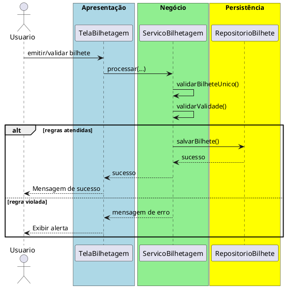

# Trabalho 21 – Sistema de Gerenciamento de Transporte Público – Bilhetagem

## Cenário
Uma autoridade de transporte público deseja um sistema desktop para emitir bilhetes eletrônicos, validar passes e registrar viagens dos usuários. O desenvolvimento será em **Java**, usando **JavaFX** e a arquitetura em **três camadas**.

## Requisitos Funcionais
| Camada | Funcionalidade |
|--------|----------------|
| **Apresentação (JavaFX)** | Tela de emissão de bilhetes, tela de validação de passes e relatório de viagens. |
| **Negócio** | • Validar dados (número do bilhete, data de validade, saldo).  • Aplicar as regras de negócio abaixo. |
| **Dados** | • Armazenar bilhetes e registros de viagens em memória (`ArrayList`).  • Operações CRUD para bilhetes e viagens. |

## Regras de Negócio (2)
1. **Bilhete Único** – Cada número de bilhete deve ser único no sistema. Se houver tentativa de cadastrar um bilhete com número já existente, a operação deve ser abortada e o usuário avisado.
2. **Validade do Bilhete** – Um bilhete só pode ser usado para validar uma viagem se a data de validade for posterior à data atual e o saldo for suficiente. Caso contrário, a operação deve ser interrompida e o usuário receberá uma mensagem de erro.

## Fluxo de Comunicação Entre as Camadas
1. Usuário emite ou valida um bilhete na interface JavaFX.  
2. A camada de apresentação envia os dados ao **Serviço de Bilhetagem** (camada de negócio).  
3. O serviço valida as duas regras; se válidas, delega ao **Repositório de Bilhetes** (camada de dados). Caso contrário, devolve mensagem de erro.  
4. A camada de apresentação captura a mensagem e a exibe em um `Alert`.

### Diagrama de Sequência

## Barema de Avaliação (100 pontos)
| Área | Peso | Critérios |
|------|------|-----------|
| **Interface Gráfica (JavaFX)** | 20 pts | Funcionalidade completa, usabilidade, mensagens de erro claras. |
| **Camada de Negócio** | 30 pts | Implementação correta das duas regras, tratamento adequado das violações. |
| **Camada de Dados** | 20 pts | Uso adequado de `ArrayList`, CRUD funcionando. |
| **Separação em Camadas** | 20 pts | Arquitetura limpa, comunicação correta. |
| **Boas Práticas** | 10 pts | Código legível, nomes coerentes, organização. |

## Entregáveis
1. Projeto Java completo (Maven/Gradle) com os pacotes `presentation`, `business`, `data` e `model`.  
2. **README** com instruções de compilação e execução.  
3. Diagrama de classes (UML) mostrando as entidades (`Bilhete`, `Viagem`).  
4. Diagrama de sequência (acima) para o caso de uso **Emitir/Validar Bilhete**.  
5. **Testes unitários** (JUnit) que comprovem:
   - Emissão bem‑sucedida com número único.
   - Falha ao emitir número duplicado.
   - Falha ao validar bilhete expirado ou com saldo insuficiente.