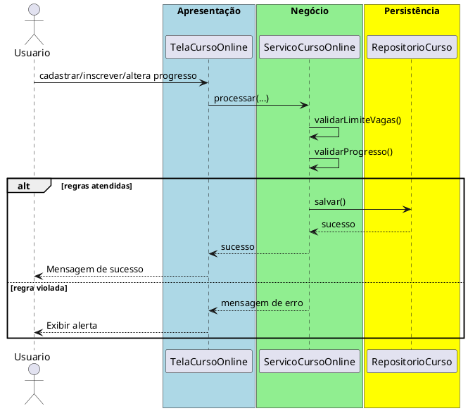

# Trabalho 22 – Sistema de Gerenciamento de Cursos Online – Inscrição e Progresso

## Cenário
Uma plataforma de ensino a distância precisa de um sistema desktop para cadastrar cursos, inscrever alunos e acompanhar o progresso de cada estudante nas aulas. O desenvolvimento será em **Java**, usando **JavaFX** e a arquitetura em **três camadas**.

## Requisitos Funcionais
| Camada | Funcionalidade |
|--------|----------------|
| **Apresentação (JavaFX)** | Tela de cadastro de cursos, tela de inscrição de alunos e painel de acompanhamento de progresso (percentual concluído). |
| **Negócio** | • Validar dados (código do curso, e‑mail do aluno, percentual).  • Aplicar as regras de negócio abaixo. |
| **Dados** | • Armazenar cursos, inscrições e progresso em memória (`ArrayList`, `HashMap`).  • Operações CRUD para todas as entidades. |

## Regras de Negócio (2)
1. **Limite de Vagas por Curso** – Cada curso possui um número máximo de vagas (ex.: 50). Quando o número de inscrições atingir esse limite, novas inscrições devem ser rejeitadas e o usuário informado que o curso está completo.
2. **Progresso Não Decrescente** – O percentual de progresso de um aluno em um curso não pode ser reduzido. Caso seja enviada uma atualização com valor menor que o já registrado, a operação deve ser abortada e o usuário receberá uma mensagem de erro.

## Fluxo de Comunicação Entre as Camadas
1. Usuário cadastra um curso ou inscreve um aluno na interface JavaFX.  
2. A camada de apresentação envia os dados ao **Serviço de Cursos Online** (camada de negócio).  
3. O serviço valida as duas regras; se válidas, delega ao **Repositório de Cursos** (camada de dados). Caso contrário, devolve mensagem de erro.  
4. A camada de apresentação captura a mensagem e a exibe em um `Alert`.

### Diagrama de Sequência

## Barema de Avaliação (100 pontos)
| Área | Peso | Critérios |
|------|------|-----------|
| **Interface Gráfica (JavaFX)** | 20 pts | Funcionalidade completa, usabilidade, mensagens de erro claras. |
| **Camada de Negócio** | 30 pts | Implementação correta das duas regras, tratamento adequado das violações. |
| **Camada de Dados** | 20 pts | Uso adequado de coleções, CRUD funcionando. |
| **Separação em Camadas** | 20 pts | Arquitetura limpa, comunicação correta. |
| **Boas Práticas** | 10 pts | Código legível, nomes coerentes, organização. |

## Entregáveis
1. Projeto Java completo (Maven/Gradle) com os pacotes `presentation`, `business`, `data` e `model`.  
2. **README** com instruções de compilação e execução.  
3. Diagrama de classes (UML) mostrando as entidades (`Curso`, `Aluno`, `Inscricao`).  
4. Diagrama de sequência (acima) para o caso de uso **Inscrever Aluno / Atualizar Progresso**.  
5. **Testes unitários** (JUnit) que comprovem:
   - Inscrição bem‑sucedida quando há vagas disponíveis.
   - Falha ao inscrever quando o curso está completo.
   - Falha ao tentar reduzir o percentual de progresso já registrado.