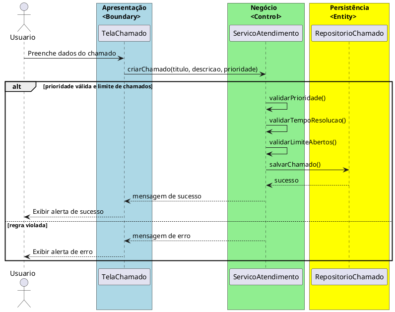

# Trabalho 23 – Sistema de Gerenciamento de Atendimentos – Chamados e Suporte

## Cenário
Um centro de suporte ao usuário precisa de um sistema desktop para registrar, acompanhar e resolver os chamados de atendimento. O sistema será desenvolvido em **Java**, usando **JavaFX** para a interface gráfica e seguirá a arquitetura em **três camadas** (Apresentação, Negócio e Dados). O objetivo é garantir o encaminhamento adequado das solicitações, a priorização de tickets e o fechamento das demandas dentro dos prazos estabelecidos.

## Requisitos Funcionais
| Camada | Funcionalidade |
|--------|----------------|
| **Apresentação (JavaFX)** | Tela debertura de chamado (campo de título, descrição, prioridade, anexo), tela de listagem de chamados, tela de atualização de status e tela de relatório de métricas. Cada tela deve exibir mensagens de erro claras quando houver validação falha. |
| **Negócio** | • Validar dados de entrada (campos obrigatórios, formato de data, prioridade entre 1‑3).  • Aplicar as regras de negócio descritas a seguir. |
| **Dados** | • Armazenar chamados em memória (`ArrayList`) e, opcionalmente, em arquivo de log.  • Implementar operações CRUD (Criar, Ler, Atualizar, Excluir) para chamados e operações de consulta por status/prioridade. |

## Regras de Negócio (3)
1. **Prioridade Obrigatória** – Toda chamada deve ter uma prioridade definida (1‑Alta, 2‑Média, 3‑Baixa). Se a prioridade for omitida, a operação deve ser abortada e o usuário deve ser informado que a prioridade é requerida.  
2. **Tempo Máximo de Resolução** – Cada prioridade possui um prazo máximo de resolução (Alta: 24 h, Média: 48 h, Baixa: 72 h). Ao fechar um chamado, o sistema deve verificar se o tempo decorrido desde a abertura está dentro do prazo da prioridade; caso contrário, a operação deve ser bloqueada e exibir mensagem de penalidade.  
3. **Limite de Chamados por Usuário** – Um usuário registrado não pode ter mais de **10 chamados abertos simultaneamente**. Se o limite for ultrapassado ao criar um novo chamado, a operação deve ser interrompida e o usuário deve receber um erro indicando o limite excedido.

## Fluxo de Comunicação Entre as Camadas
1. O usuário preenche o formulário de criação de chamado na interface JavaFX.  
2. A **Camada de Apresentação** envia os dados ao **Serviço de Atendimento** (camada de negócio).  
3. O serviço verifica as três regras de negócio. Se todas forem satisfeitas, ele delega ao **Repositório de Chamados** (camada de dados) para persistir o registro; caso contrário, devolve uma mensagem de erro ao front‑end.  
4. Ao atualizar o status de um chamado, o serviço valida novamente as regras aplicáveis (por exemplo, prazo de resolução) antes de chamar o repositório para atualizar.  
5. A **Camada de Apresentação** captura as respostas (sucesso ou erro) e as exibe ao usuário em `Alert`s ou outras notificações.

### Diagrama de Sequência

## Barema de Avaliação (100 pontos)
| Área | Peso | Critérios |
|------|------|-----------|
| **Interface Gráfica (JavaFX)** | 20 pts | Funcionalidade completa, usabilidade, exibição clara de mensagens de erro e validação de campos. |
| **Camada de Negócio** | 30 pts | Implementação correta das três regras de negócio, tratamento adequado das violações (mensagens de erro), validação de prioridade e prazo de resolução. |
| **Camada de Dados** | 20 pts | Uso adequado de `ArrayList`, operações CRUD funcionando, persistência opcional em arquivo de log. |
| **Separação em Camadas** | 20 pts | Arquitetura limpa, comunicação correta entre as camadas, organização de pacotes (`presentation`, `business`, `data`). |
| **Boas Práticas** | 10 pts | Código legível, nomes coerentes, ausência de duplicação, uso de boas práticas de JavaFX e Java Collections. |

## Entregáveis
1. Projeto Java completo (Maven ou Gradle) contendo os pacotes `presentation`, `business`, `data` e `model`.  
2. **README** com instruções de compilação e execução (`mvn clean package && java -jar target/atendimentos.jar`).  
3. Diagrama deClasses (UML) mostrando as entidades (`Chamado`, `Prioridade`, `Usuario`) e as camadas.  
4. Diagrama de sequência (como o acima) para o caso de uso **Registrar Novo Chamado**.  
5. **Testes unitários** (JUnit) que comprovem:  
   - Sucesso ao criar um chamado que respeita todas as regras.  
   - Falha ao criar um chamado sem prioridade.  
   - Falha ao ultrapassar o limite de 10 chamados abertos por usuário.  
   - Falha ao fechar um chamado fora do prazo de resolução da sua prioridade.