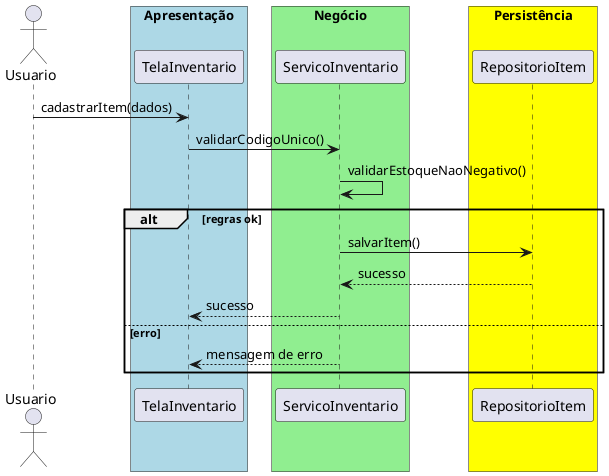

# Trabalho 27 – Sistema de Gerenciamento de Inventário de Laboratório

## Cenário
Um laboratório de pesquisa precisa de um sistema desktop para controlar equipamentos, reagentes e materiais. O sistema será desenvolvido em **Java**, com **JavaFX** e arquitetura em **três camadas**.

## Requisitos Funcionais
| Camada | Funcionalidade |
|--------|----------------|
| **Apresentação (JavaFX)** | Tela de cadastro de itens, tela de movimentação (entrada/saída), tela de relatório de inventário.
| **Negócio** | • Validar campos (código, descrição, quantidade).  • Aplicar regras de negócio abaixo.
| **Dados** | • Armazenar itens em memória (`ArrayList`, `HashMap`).  • Operações CRUD e histórico de movimentação.

## Regras de Negócio (2)
1. **Código Único do Item** – Cada item deve ter um código único. Tentativa de cadastro duplicado gera erro.
2. **Estoque Não Negativo** – Saídas não podem gerar quantidade negativa. Se ocorrer, bloqueia a operação.

## Fluxo de Comunicação
1. Usuário preenche formulário.
2. Camada de Apresentação envia ao Serviço de Inventário.
3. Serviço valida regras e delega ao Repositório.
4. Resultado retornado e exibido.

### Diagrama de Sequência

## Barema de Avaliação (100 pontos)
| Área | Peso | Critérios |
|------|------|-----------|
| Interface | 20 pts | Funcionalidade completa, mensagens claras |
| Negócio | 30 pts | Regras implementadas corretamente |
| Dados | 20 pts | Uso adequado de coleções, CRUD |
| Camadas | 20 pts | Arquitetura limpa |
| Boas Práticas | 10 pts | Código legível

## Entregáveis
1. Projeto Java completo (Maven/Gradle) com pacotes `presentation`, `business`, `data`, `model`.
2. README com instruções.
3. Diagrama de classes (`Item`, `Movimentacao`).
4. Diagrama de sequência (cadastrar item).
5. Testes JUnit: cadastro único, rejeição de duplicado, saída que gera estoque negativo.