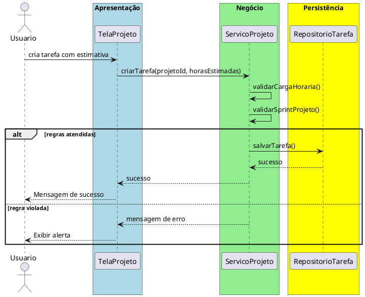

# Trabalho 28 – Sistema de Gerenciamento de Projetos – Tarefas e Sprints

## Cenário
Equipes de desenvolvimento precisam de um sistema desktop para organizar tarefas, sprints e acompanhar o progresso de projetos ágeis. O sistema será desenvolvido em **Java**, usando **JavaFX** e seguindo a arquitetura em **três camadas**.

## Requisitos Funcionais
| Camada | Funccionalidade |
|--------|----------------|
| **Apresentação (JavaFX)** | Tela de cadastro de projetos, tela de criação de sprints, tela de adição/atualização de tarefas, quadro Kanban.
| **Negócio** | • Validar datas de início/fim, prioridade, carga horária.  • Aplicar regras de negócio.
| **Dados** | • Armazenar projetos, sprints, tarefas em memória (`ArrayList`, `HashMap`).  • CRUD e consulta por projeto/sprint.

## Regras de Negócio (2)
1. **Sprint Dentro do Projeto** – Uma sprint deve ter início e fim dentro do intervalo do projeto. Se não, bloqueia a criação.
2. **Carga Horária Máxima por Tarefa** – Uma tarefa não pode exceder 40 horas de estimativa. Se houver, avisa e impede o cadastro.

## Fluxo de Comunicação
1. Usuário interage com a interface JavaFX.
2. Camada de Apresentação envia dados ao Serviço de Projeto.
3. Serviço valida regras (datas, carga).
4. Se válido, persiste via Repositório; caso contrário, devolve erro.
5. Camada de Apresentação exibe resultado ao usuário.

### Diagrama de Sequência

## Barema de Avaliação (100 pontos)
| Área | Peso | Critérios |
|------|------|-----------|
| Interface (JavaFX) | 20 pts | Usabilidade, quadro Kanban funcional |
| Negócio | 30 pts | Implementação das regras de sprint e carga horária |
| Dados | 20 pts | Uso correto de coleções, CRUD |
| Separação em Camadas | 20 pts | Arquitetura 3 camadas clara |
| Boas Práticas | 10 pts | Código limpo, boa organização |

## Entregáveis
1. Projeto Java (Maven/Gradle) com pacotes `presentation`, `business`, `data`.
2. README com instruções de compilação e execução.
3. Diagrama de classes (`Projeto`, `Sprint`, `Tarefa`).
4. Diagrama de sequência (criar tarefa).
5. Testes JUnit: validar carga horária máxima, validar sprint dentro do projeto, erro em datas inválidas.