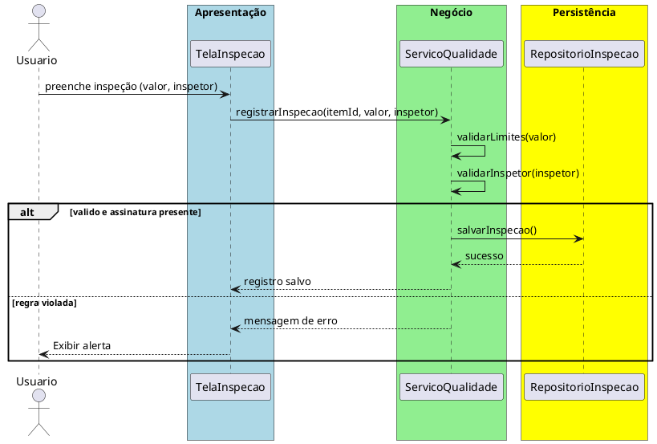

# Trabalho 29 – Sistema de Controle de Qualidade – Inspeções e Relatórios

## Cenário
Uma indústria precisa de um sistema para registrar inspeções de qualidade, gerar relatórios de conformidade e acompanhar não-conformidades. O sistema será desenvolvido em **Java**, usando **JavaFX** e arquitetura em **três camadas**.

## Requisitos Funcionais
| Camada | Funcionalidade |
|--------|----------------|
| **Apresentação (JavaFX)** | Tela de registro de inspeção (item, critério, resultado), tela de relatórios por período, tela de não-conformidades pendentes.
| **Negócio** | • Validar dados de inspeção (valor dentro de limites, assinatura do inspetor).  • Aplicar regras de negócio abaixo.
| **Dados** | • Armazenar inspeções e relatórios (`ArrayList`, `HashMap`).  • Operações CRUD e cálculo de métricas.

## Regras de Negócio (2)
1. **Valor Dentro dos Limites** – Cada inspeção possui um limite inferior e superior. Se o valor medido estiver fora desses limites, a inspeção é marcada como não-conforme.
2. **Assinatura Obrigatória do Inspetor** – Toda inspeção deve ter o nome ou ID do inspetor registrado. Se omitido, a operação falha.

## Fluxo de Comunicação
1. Usuário preenche formulário de inspeção.
2. Camada de Apresentação envia dados ao Serviço de Qualidade.
3. Serviço verifica limites e assinatura.
4. Se valido, salva e calcula métricas; caso contrário, devolve erro.
5. Interface exibe resultado.

### Diagrama de Sequência

## Barema de Avaliação (100 pontos)
| Área | Peso | Critérios |
|------|------|-----------|
| Interface (JavaFX) | 20 pts | Formulário de inspeção, exibição de relatórios |
| Negócio | 30 pts | Implementação correta das regras de limites e assinatura |
| Dados | 20 pts | Uso adequado de coleções, armazenamento de inspeções |
| Separação em Camadas | 20 pts | Arquitetura em 3 camadas clara |
| Boas Práticas | 10 pts | Código legível, nomes coerentes |

## Entregáveis
1. Projeto Java (Maven/Gradle) com pacotes `presentation`, `business`, `data`.
2. README com instruções de execução.
3. Diagrama de classes (`Inspecao`, `Inspetor`).
4. Diagrama de sequência (registro de inspeção).
5. Testes JUnit: inspeção dentro dos limites aprovada, fora dos limites marcada como não-conforme, falta de assinatura resulta em erro.