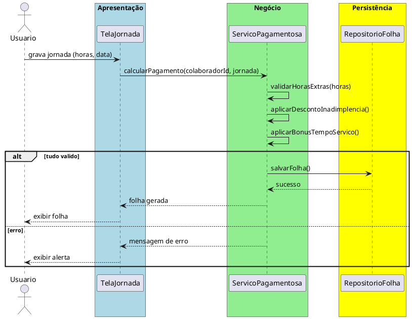

# Trabalho 30 – Sistema de Gerenciamento de Recursos Humanos – Folha de Pagamento

## Cenário
Uma empresa deseja um sistema desktop para gerir a folha de pagamento dos colaboradores, calcular salários, descontos e benefícios. O sistema será desenvolvido em **Java**, usando **JavaFX** e arquitetura em **três camadas**.

## Requisitos Funcionais
| Camada | Funccionalidade |
|--------|----------------|
| **Apresentação (JavaFX)** | Tela de cadastro de colaboradores, tela de registro de jornada, tela de geração de folha, tela de relatórios de pagamentos.
| **Negócio** | • Validar dados de entrada (data, horas, frequência). • Aplicar regras de cálculo de pagamento, descontos e benefícios.
| **Dados** | • Armazenar colaboradores, jornadas e folha em memória (`ArrayList`, `HashMap`).

## Regras de Negócio (3)
1. **Horas Extras Acima de 8 Horas / Dia** – Se um colaborador trabalhar mais que 8 horas em um dia, as horas extras são calculadas em 1,5×do valor da hora normal.
2. **Desconto por Inadimplência** – Caso o colaborador tenha devedor de benefícios, aplica desconto de 5% do salário bruto.
3. **Benefício por Tempo de Serviço** – Colaboradores com mais de 5 anos de empresa recebem um bônus de 10% do salário bruto.

## Fluxo de Comunicação
1. Usuário registra a jornada do colaborador.
2. Camada de Apresentação envia dados ao Serviço de Pagamento.
3. Serviço valida regras e calcula valor líquido.
4. Se tudo for válido, persistir o registro de pagamento; caso contrário, retorna erro.
5. Interface exibe resultado em folha de pagamento.

### Diagrama de Sequência

## Barema de Avaliação (100 pontos)
| Área | Peso | Critérios |
|------|------|-----------|
| Interface (JavaFX) | 20 pts | Cadastro e visualização da folha funcional |
| Negócio | 30 pts | Cálculo correto de horas extras, descontos e bônus |
| Dados | 20 pts | Estrutura adequada de armazenamento em memoria |
| Separação em Camadas | 20 pts | Arquitetura 3 camadas bem definida |
| Boas Práticas | 10 pts | Código legível, nomes adequados |

## Entregáveis
1. Projeto Java (Maven/Gradle) com pacotes `presentation`, `business`, `data`.
2. README com instruções de compilação e uso.
3. Diagrama de classes (`Colaborador`, `FolhaPagamento`, `Beneficio`).
4. Diagrama de sequência (geração de folha).
5. Testes JUnit: cálculo de horas extras correto, aplicação de desconto, bônus de tempo de serviço.