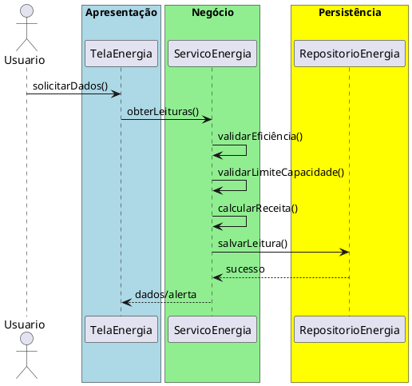

# Trabalho 32 – Sistema de Gestão de Energia Renovável

## Cenário
Empresas que utilizam fontes de energia renovável (solar, eólica, hidráulica) precisam monitorar a geração, eficiência e custos. O sistema será desenvolvido em **Java**, com **JavaFX** e arquitetura em **três camadas**.

## Requisitos Funcionais
| Camada | Funcionalidade |
|--------|----------------|
| **Apresentação (JavaFX)** | Tela de monitoramento em tempo real, histórico de geração, gráficos de eficiência e relatórios financeiros.
| **Negócio** | • Calcular eficiência das instalações.  • Alertar falhas ou baixa produção.  • Projetar estimativas de receita baseada em tarifas.
| **Dados** | • Armazenar leituras de geração em `ArrayList`/CSV.  • Operações CRUD para instalações e relatórios.

## Regras de Negócio (3)
1. **Eficiência Mínima** – Se a eficiência cair abaixo de 70 % em 24 h, gerar alerta de manutenção.
2. **Limite de Geração** – Não permitir registro de geração superior à capacidade instalada da fonte.
3. **Cálculo de Receita** – Receita = energia gerada (kWh) × tarifa vigente; deve ser recalculada a cada nova leitura.

## Fluxo de Comunicação
1. Usuário visualiza dashboard.
2. Camada de Apresentação solicita dados ao **Serviço de Energia**.
3. Serviço valida eficiência e limites, calcula receita e delega ao **Repositório de Dados**.
4. Resultado (dados ou alerta) é exibido ao usuário.

### Diagrama de Sequência

## Barema de Avaliação (100 pontos)
| Área | Peso | Critérios |
|------|------|-----------|
| Interface (JavaFX) | 20 pts | Dashboard funcional, alertas claros |
| Negócio | 30 pts | Regras implementadas corretamente |
| Dados | 20 pts | Armazenamento adequado e CRUD |
| Camadas | 20 pts | Arquitetura limpa de 3 camadas |
| Boas Práticas | 10 pts | Código legível e organizado |

## Entregáveis
1. Projeto Java (Maven/Gradle) com pacotes `presentation`, `business`, `data`.
2. README com instruções de compilação e execução.
3. Diagrama de classes (`Instalacao`, `Leitura`, `Relatorio`).
4. Diagrama de sequência (obter dados).
5. Testes JUnit: alerta por baixa eficiência, rejeição de geração acima da capacidade, cálculo correto de receita.