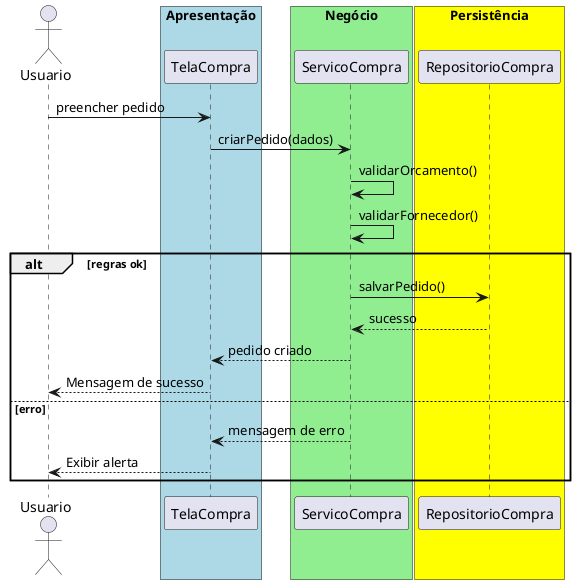

# Trabalho 33 – Sistema de Gestão de Compras Corporativas

## Cenário
Grandes empresas precisam controlar solicitações, cotações, aprovações e recebimento de insumos. O sistema será desenvolvido em **Java**, usando **JavaFX** e arquitetura em **três camadas**.

## Requisitos Funcionais
| Camada | Funcionalidade |
|--------|----------------|
| **Apresentação (JavaFX)** | Tela de cadastro de fornecedores, centro de custos (ligados aos produtos), criação de pedidos de compra, acompanhamento de cotações, aprovação de compras e registro de recebimento.
| **Negócio** | • Validar orçamento disponível.  • Verificar conformidade de fornecedor (habilitado).  • Aplicar descontos conforme tabela negociada.
| **Dados** | • Armazenar fornecedores, pedidos e cotações em `ArrayList`/`HashMap`.  • CRUD completo para cada entidade.

## Regras de Negócio (2)
1. **Orçamento Suficiente** – O valor total do pedido não pode ultrapassar o orçamento liberado para o centro de custo.
2. **Fornecedor Habilitado** – Só é permitido criar pedido para fornecedor com status “ativo” e sem pendências financeiras.

## Fluxo de Comunicação
1. Usuário preenche pedido de compra.
1. Camada de Apresentação envia dados ao **Serviço de Compras**.
1. Se tudo estiver correto, persiste o pedido e devolve confirmação.
1. Caso alguma regra falhe, exibe mensagem de erro.

### Diagrama de Sequência

## Barema de Avaliação (100 pontos)
| Área | Peso | Critérios |
|------|------|-----------|
| Interface (JavaFX) | 20 pts | Telas de compra completas e usáveis |
| Negócio | 30 pts | Implementação das três regras de negócio |
| Dados | 20 pts | Armazenamento e CRUD funcionando |
| Separação em Camadas | 20 pts | Arquitetura em 3 camadas bem definida |
| Boas Práticas | 10 pts | Código limpo e organizado |

## Entregáveis
1. Projeto Java (Maven/Gradle) com pacotes `presentation`, `business`, `data`.
2. README com instruções de compilação e execução.
3. Diagrama de classes (`Fornecedor`, `PedidoCompra`, `Cotacao`, `CentroCusto`, `Produto`).
4. Diagrama de sequência (criação de pedido).
5. Testes JUnit: orçamento insuficiente, fornecedor desabilitado.