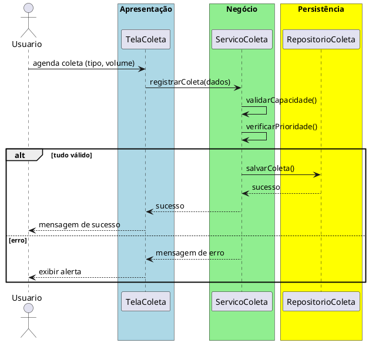

# Trabalho 33 – Sistema de Gestão de Resíduos Sólidos

## Cenário
Municípios e empresas precisam de um sistema para acompanhar a coleta, reciclagem, destinação e relatórios de resíduos. O sistema será desenvolvido em **Java**, usando **JavaFX** e arquitetura em **três camadas**.

## Requisitos Funcionais
| Camada | Funcionalidade |
|--------|----------------|
| **Apresentação (JavaFX)** | Tela de cadastro decontêineres, registro de coleta, visualização de relatórios de volume e mapa de pontos de coleta.
| **Negócio** | • Validar tipo de resíduo e limite de capacidade.  • Aplicar regras de prioridade de coleta (resíduos perigosos primeiro).  • Gerar alertas para rotas fora do padrão.
| **Dados** | • Armazenar contêineres, rotas e registros em memória (`ArrayList`, `HashMap`).  • Operações CRUD e cálculo de métricas de reciclagem.

## Regras de Negócio (2)
1. **Capacidade do Contêiner** – Não é permitido registrar uma coleta que ultrapasse a capacidade máxima do contêiner. Se a tentativa for feita, aborta‑se a operação e exibe‑se mensagem de erro.
2. **Prioridade de Coleta** – Resíduos classificados como perigosos devem ter prioridade em relação a outros tipos. Se houver mais de um pedido simultâneo, os não‑perigosos são adiamados até que todos os perigos sejam processados.

## Fluxo de Comunicação
1. Usuário registra ou agenda uma coleta.
2. Camada de Apresentação envia dados ao **Serviço de Coleta**.
3. Serviço verifica capacidade e prioridade, valida regras.
4. Caso tudo esteja correto, persiste a coleta via **Repositório de Coleta**; caso contrário, retorna erro.
5. Camada de Apresentação exibe sucesso ou mensagem de erro ao usuário.

### Diagrama de Sequência

## Barema de Avaliação (100pontos)
| Área | Peso | Critérios |
|------|------|-----------|
| Interface (JavaFX) | 20 pts | Tela de cadastro e visualização de relatórios |
| Negócio | 30 pts | Implementação correta da capacidade e prioridade |
| Dados | 20 pts | Uso adequado de coleções e operações CRUD |
| Separação em Camadas | 20 pts | Arquitetura limpa com 3 camadas |
| Boas Práticas | 10 pts | Código legível e bem organizado |

## Entregáveis
1. Projeto Java (Maven/Gradle) com pacotes `presentation`, `business`, `data`.
2. README com instruções de compilação e execução.
3. Diagrama deClasses (`Contêiner`, `Coleta`, `Relatorio`).
4. Diagrama de sequência (registro de coleta).
5. Testes JUnit: teste de capacidade excedida, prioridade de coleta perigosa, cálculo de métricas de reciclagem.