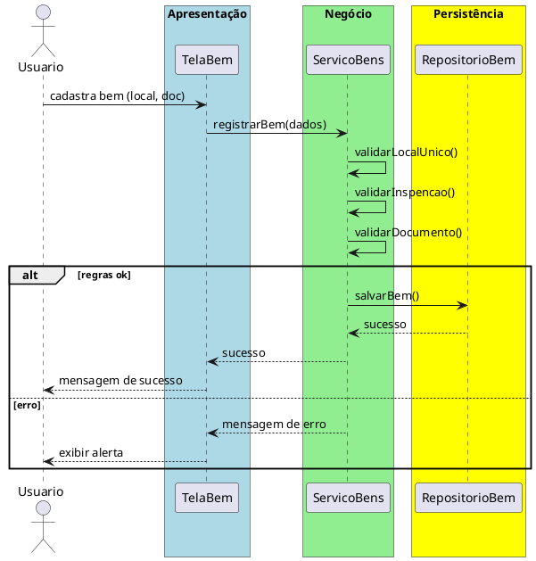

# Trabalho 36 – Sistema de Gestão de Bens Públicos

## Cenário
Órgãos públicos precisam controlar o uso, manutenção e inventário de bens móveis e imóveis. O sistema será desenvolvido em **Java**, com **JavaFX** e arquitetura em **três camadas**.

## Requisitos Funcionais
| Camada | Funcionalidade |
|--------|----------------|
| **Apresentação (JavaFX)** | Tela de cadastro de bens, atribuição a órgãos, agendamento de manutenção, relatório de disponibilidade.
| **Negócio** | • Validar documento de propriedade (matrícula, docto).  • Aplicar regras de disponibilidade (não pode ter outro bem no mesmo local).  • Verificar vencimento de inspeções obrigatórias.
| **Dados** | • Armazenar bens em `ArrayList`, relacionamentos em `HashMap`.  • Operações CRUD.

## Regras de Negócio (3)
1. **Local Único** – Um local não pode abrigar dois bens simultâneos. Ao atribuir, verificar se já existe outro bem no local.
2. **Inspeção Obrigatória** – Se o vencimento da inspeção for anterior à data atual, alertar e impedir nova atribuição até regularização.
3. **Documentação Completa** – Todo bem deve ter documento de propriedade e foto anexa; caso contrário, não permite salvar.

## Fluxo de Comunicação
1. Usuário preenche cadastro de bem.
2. Camada de Apresentação envia ao **Serviço de Bens**.
3. Serviço valida local, inspeção e documentação.
4. Se válido, persiste via **Repositório**; caso contrário, devolve erro.
5. Camada de Apresentação exibe resultado.

### Diagrama de Sequência

## Barema de Avaliação (100 pontos)
| Área | Peso | Critérios |
|------|------|-----------|
| Interface (JavaFX) | 20 pts | Tela de cadastro e relatórios |
| Negócio | 30 pts | Implementação das 3 regras |
| Dados | 20 pts | Armazenamento e CRUD |
| Separação em Camadas | 20 pts | Arquitetura em 3 camadas |
| Boas Práticas | 10 pts | Código organizado |

## Entregáveis
1. Projeto Java (Maven/Gradle) com pacotes `presentation`, `business`, `data`.
2. README com instruções.
3. Diagrama de classes (`Bem`, `Local`, `Inspencao`).
4. Diagrama de sequência (registrar bem).
5. Testes JUnit: local já ocupado rejeitado, inspeção vencida alertada, documento incompleto bloqueado.