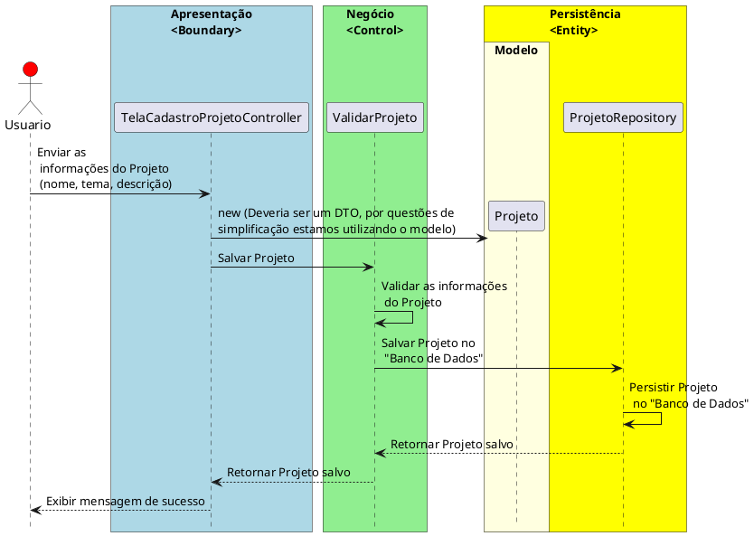

# Estrutura Geral do Trabalho

A estrutura do trabalho é baseada na arquitetura em três camadas: **Camada de Apresentação**, **Camada de Negócio** e **Camada de Dados**. No entanto, nesta proposta, os dados não serão persistidos em um banco de dados, mas sim em estruturas de dados temporárias, como listas ou mapas, mantidas na memória durante a execução do programa.

## Camada de Apresentação (UI - JavaFX)

Responsável por toda a interação com o usuário. Esta camada deve exibir a interface gráfica, coletar dados dos formulários e apresentar os resultados ou mensagens de erro de maneira clara e amigável. É onde o JavaFX será utilizado para criar as janelas, botões, formulários e outros componentes gráficos.

### Exemplo de Funcionalidade

Um formulário para cadastrar produtos em um sistema de estoque ou uma tela que exibe o status das tarefas em um gerenciador de tarefas.

## Camada de Negócio (Business Logic)

Contém a lógica do sistema e as regras de negócio. Nesta camada, são verificadas as condições impostas pelo domínio da aplicação (por exemplo, limites de estoque, validação de dados, etc.). Essa camada também é responsável por lançar exceções específicas quando as regras de negócio são violadas.

### Exemplo de Funcionalidade

Em um sistema de gerenciamento de estoque, esta camada seria responsável por verificar se a quantidade de produtos é suficiente antes de permitir uma venda ou gerar exceções caso um valor inválido seja informado.

## Camada de Dados (Data Access)

Gerencia os dados da aplicação. Embora não haja persistência em um banco de dados, os dados serão armazenados temporariamente em estruturas de dados em memória (como `ArrayList`, `HashMap`, etc.). Esta camada simula o comportamento de uma camada de persistência, mas sem a necessidade de conexão com um banco de dados.

### Exemplo de Funcionalidade

Gerenciar a lista de produtos cadastrados, recuperar os dados de um produto ou remover um produto da lista. Todas as operações de CRUD (Create, Read, Update, Delete) serão realizadas diretamente sobre essas estruturas temporárias.

## Fluxo de Comunicação Entre as Camadas

1. O usuário interage com a **Camada de Apresentação** (JavaFX), por exemplo, preenchendo um formulário de cadastro de um produto.
2. A **Camada de Apresentação** envia os dados para a **Camada de Negócio**.
3. A **Camada de Negócio** aplica as regras e validações. 
4. Se a validação for bem-sucedida, a **Camada de Negócio** interage com a **Camada de Dados** para armazenar, recuperar ou modificar os dados.
5. Qualquer erro ou exceção gerada na **Camada de Negócio** é capturada pela **Camada de Apresentação** e exibida de maneira amigável para o usuário.

### Diagrama de Sequência

Exemplo de Diagrama de Sequência para o caso de uso "Cadastrar Projeto":

## Barema para Avaliação do Trabalho

O barema a seguir será utilizado para avaliar a implementação do projeto. Cada critério possui um peso específico, totalizando 100 pontos.

### 1. **Interface Gráfica (JavaFX) - 20 pontos**
   - **Completude e Funcionalidade da Interface (10 pontos)**: A interface permite que o usuário realize todas as ações propostas no trabalho (ex: cadastrar, remover, atualizar dados).
   - **Usabilidade e Apresentação (5 pontos)**: A interface é amigável, clara e intuitiva, com uma boa organização dos componentes gráficos.
   - **Exibição de Mensagens de Erro (5 pontos)**: As mensagens de erro e exceções são exibidas de forma clara, amigável e ajudam o usuário a corrigir os erros.

### 2. **Camada de Negócio (Regras de Negócio) - 30 pontos**
   - **Implementação das Regras de Negócio (20 pontos)**: Todas as regras de negócio especificadas no projeto foram implementadas corretamente e respeitam as condições do domínio (ex: limites de estoque, validação de campos).
   - **Tratamento e Lançamento de Exceções (10 pontos)**: As exceções são corretamente lançadas pela camada de negócio quando há uma violação das regras. As exceções devem ser personalizadas (ex: `ProdutoInvalidoException`, `EstoqueInsuficienteException`).

### 3. **Camada de Dados (Estruturas de Dados em Memória) - 20 pontos**
   - **Implementação das Estruturas de Dados (10 pontos)**: Os dados são corretamente gerenciados utilizando as estruturas de dados apropriadas (ex: `ArrayList`, `HashMap`). As operações de inserção, remoção, leitura e atualização funcionam adequadamente.
   - **Organização e Simulação de Persistência (10 pontos)**: A camada de dados é bem estruturada e simula a persistência de forma organizada, separando claramente a lógica de acesso a dados das regras de negócio.

### 4. **Separação em Camadas - 20 pontos**
   - **Segregação Correta das Funções (10 pontos)**: A separação entre as camadas de apresentação, negócio e dados está clara, com cada uma desempenhando corretamente suas responsabilidades.
   - **Comunicação Entre as Camadas (10 pontos)**: A comunicação entre as camadas é feita de maneira fluida e correta, utilizando métodos e estruturas apropriadas para transferir dados entre as camadas.

### 5. **Boas Práticas - 10 pontos**
   - **Boas Práticas de Programação (10 pontos)**: O código segue boas práticas, incluindo nomeação adequada de variáveis, métodos e classes, além de evitar duplicação de código e garantir uma organização clara do projeto.